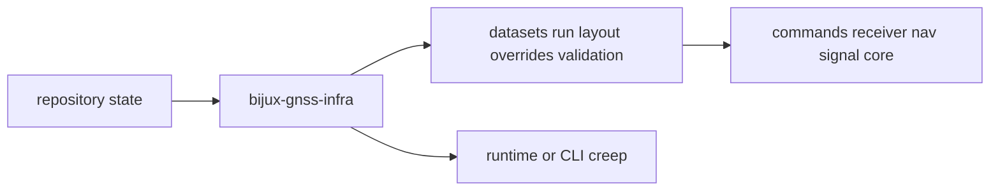

# Foundation

Open this section when the question is why `bijux-gnss-infra` owns repository
state and persisted run structure before any command or runtime layer starts
explaining behavior away.

## Boundary Model

The infrastructure boundary is only trustworthy when a reader can see where
repository-facing concerns stop and where runtime, science, or command policy
must take back ownership.

## Read These First

- open [Ownership Boundary](ownership-boundary.md) first when a feature feels
  adjacent to receiver, nav, or CLI behavior
- open [Package Overview](package-overview.md) when you need the shortest
  durable description of the crate role
- open [Scope and Non-Goals](scope-and-non-goals.md) when the question is what
  infra should explicitly refuse

## The Mistake This Section Prevents

The most common mistake here is smuggling product behavior into infrastructure
because files, manifests, or datasets happen to be involved.

## Pages In This Section

- [Package Overview](package-overview.md)
- [Scope and Non-Goals](scope-and-non-goals.md)
- [Ownership Boundary](ownership-boundary.md)
- [Repository Fit](repository-fit.md)
- [Domain Language](domain-language.md)
- [Dependencies and Adjacencies](dependencies-and-adjacencies.md)
- [Change Principles](change-principles.md)

## First Proof Check

- `crates/bijux-gnss-infra/src/datasets/`
- `crates/bijux-gnss-infra/src/run_layout/`
- `crates/bijux-gnss-infra/src/artifact_inspection/`
- `crates/bijux-gnss-infra/src/overrides/`
- `crates/bijux-gnss-infra/docs/CONTRACTS.md`

## Leave This Section When

- leave for [Interfaces](../interfaces/) when the dispute is already about
  manifest shape, dataset records, or override contracts
- leave for [Architecture](../architecture/) when the ownership question is
  settled and the next question is where the code lives
- leave for [Quality](../quality/) when the boundary is clear and the question
  becomes whether the infrastructure trust story is strong enough
