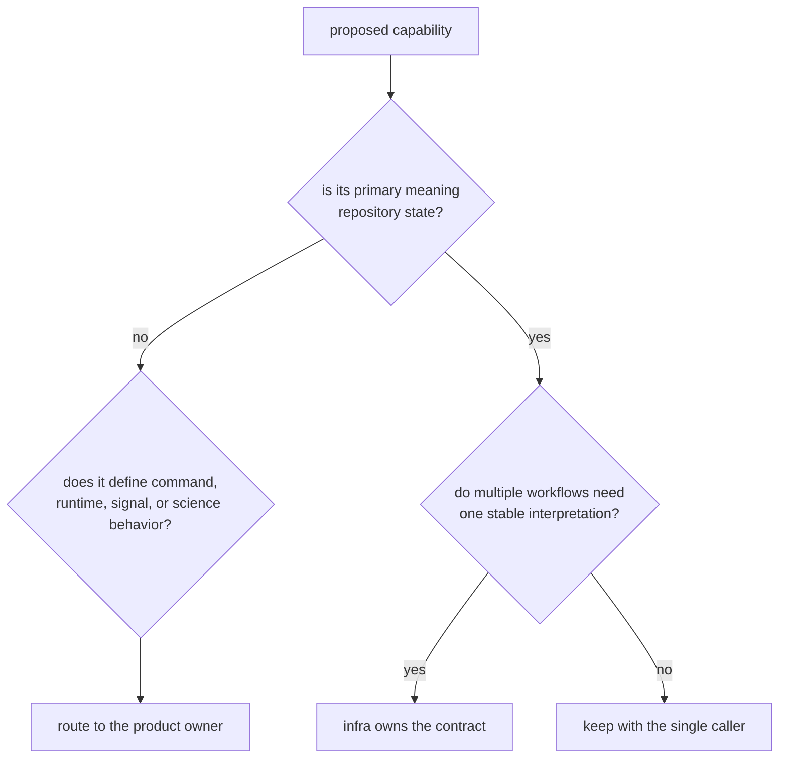

# Ownership Boundary

`bijux-gnss-infra` owns a concern when its durable value is one shared
interpretation of repository state. Filesystem access alone is not enough:
commands, receiver stages, navigation products, and signal inputs all touch
files without transferring their domain ownership to infra.

## What Infra Owns

| repository concern | infra responsibility | ownership limit |
| --- | --- | --- |
| dataset registry and sidecars | normalize locations, preserve capture provenance, resolve ingest metadata | signal metadata defines sample meaning; a registry entry does not prove signal quality |
| run identity and layout | derive deterministic placement and expose typed locations | command code chooses intent; producer packages create domain evidence |
| manifests, reports, and history | preserve execution context and make runs discoverable | shared records retain their original semantic owner |
| artifact inspection | identify current-schema artifacts and report diagnostics | producer packages establish runtime or scientific correctness |
| overrides and sweeps | apply declared variation to typed configuration | receiver owns the configuration fields and their runtime meaning |
| provenance and hashing | record repository-facing comparison context | a hash is not a complete reproducibility guarantee |
| reference adapters | align persisted solutions with reference epochs | receiver and navigation own quality thresholds and estimator claims |

## Route Non-Infra Concerns

| concern | owning handbook | why |
| --- | --- | --- |
| command names, flags, workflow selection, report wording | [Command handbook](../../01-bijux-gnss/) | operator behavior is a public product boundary |
| shared identifiers, units, time, diagnostics, artifact envelopes | [Core handbook](../../02-bijux-gnss-core/) | cross-package meaning must remain independent of persistence |
| orbit products, corrections, estimators, PPP, RTK, integrity | [Navigation handbook](../../04-bijux-gnss-nav/) | scientific models require navigation-owned proof |
| stage execution, ports, channels, runtime metrics, in-memory artifacts | [Receiver handbook](../../05-bijux-gnss-receiver/) | runtime orchestration owns state transitions and execution policy |
| signal catalog, code generation, DSP, sample conversions | [Signal handbook](../../06-bijux-gnss-signal/) | reusable signal behavior must stay below repository workflows |
| audits, test-lane policy, benchmarks, maintainer evidence | [Maintainer handbook](../../07-bijux-gnss-dev/) | repository governance is not product infrastructure |

## Ownership Decision

Test the decision with concrete language:

- "Resolve the same registered dataset for commands and tests" belongs in
  infra.
- "Decide whether a capture has enough C/N0 for acquisition" belongs in the
  receiver.
- "Persist the receiver's declared outcome with provenance" belongs in infra.
- "Choose whether an operator command treats that outcome as failure" belongs
  in the command package.
- "Expose a lower-owner type because one import is shorter" has no ownership
  case.

## Verify A Boundary Claim

Start with the [infra boundary guide](../../../crates/bijux-gnss-infra/docs/BOUNDARY.md)
and [infra contract guide](../../../crates/bijux-gnss-infra/docs/CONTRACTS.md).
Then compare the proposed behavior with the owning handbook above. If the
behavior cannot be described without receiver policy, command UX, signal math,
or navigation science, infra is the wrong owner even when persistence is
involved.
