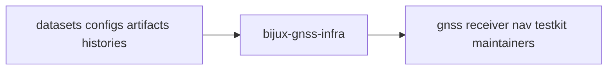

# Package Overview

`bijux-gnss-infra` exists to make repository-facing GNSS state typed,
repeatable, and inspectable.

Its job is not to be "the place where repository things go." Its job is to
own the repository contracts that more product-facing crates should consume
instead of reimplementing.

## Role Model

If the repository needs one stable interpretation of datasets, run identity,
artifact persistence context, profile overrides, or provenance hashing, this is
usually the crate that should own it.

The durable centers of gravity are:

- `src/datasets/registry.rs` plus `src/datasets/registry/` for dataset lookup
  and entry parsing
- `src/datasets/raw_iq_metadata.rs` plus `src/datasets/raw_iq_metadata/` for
  sidecar loading, sample metadata, and capture validation
- `src/run_layout.rs` plus `src/run_layout/` for run identity, directories,
  persisted records, and provenance capture
- `src/artifact_inspection/` and `src/validate_reference.rs` for repository
  inspection and validation adapters
- `src/overrides/`, `src/experiments.rs`, `src/sweep.rs`, and `src/hash/` for
  typed experiment variation, override application, and provenance helpers

## Boundary Verdict

If the work makes repository state more typed, reproducible, or auditable
without becoming runtime or solver policy, it belongs here. If it starts
deciding signal processing, navigation estimation, receiver scheduling, or
command UX, it has crossed the boundary.

## What This Package Makes Possible

- commands and tests can rely on one dataset registry interpretation
- persisted run footprints stay stable after the command that produced them is
  gone
- experiment variation stays typed instead of becoming shell string handling
- artifact inspection can happen after execution without re-entering runtime
  code

## Tempting Mistakes

- putting receiver defaults into overrides because they are "config related"
- storing repository layout policy inside artifact payload definitions
- making command semantics responsible for dataset resolution rules that should
  be shared everywhere

## First Proof Check

- `crates/bijux-gnss-infra/src/api.rs`
- `crates/bijux-gnss-infra/src/datasets/registry.rs`
- `crates/bijux-gnss-infra/src/datasets/raw_iq_metadata.rs`
- `crates/bijux-gnss-infra/src/run_layout.rs`
- `crates/bijux-gnss-infra/src/run_layout/`
- `crates/bijux-gnss-infra/src/overrides/receiver_profile.rs`
- `crates/bijux-gnss-infra/src/sweep.rs`
- `crates/bijux-gnss-infra/src/artifact_inspection/`
