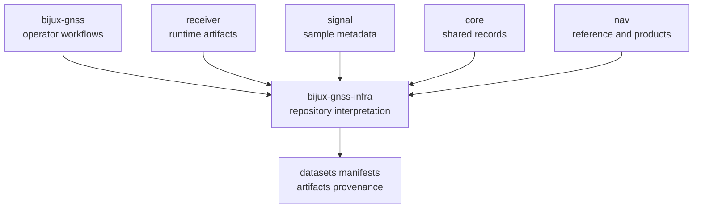

# Repository Fit

`bijux-gnss-infra` lives at the seam between product crates and repository
state.

## Fit Map

## Adjacencies

| neighbor | infra relationship | boundary risk |
| --- | --- | --- |
| `bijux-gnss` | commands call infra for datasets, run layouts, manifests, sweeps, and validation adapters | command code starts owning repository semantics |
| `bijux-gnss-receiver` | receiver creates runtime evidence that infra persists, explains, or varies | infra starts reassembling receiver runtime |
| `bijux-gnss-signal` | signal defines raw-IQ metadata and sample meaning that infra resolves from sidecars | infra starts redefining sample semantics |
| `bijux-gnss-core` | core provides records and validation language that infra stores and interrogates | infra starts redefining core payload meaning |
| `bijux-gnss-nav` | nav participates through precise products, references, and optional validation flows | infra starts owning navigation science |

## Fit Rule

Infra should feel close to many owners without becoming a second home for their
behavior. Its value is shared repository interpretation: turning files,
sidecars, run directories, artifacts, overrides, and provenance into typed
state that other crates can trust.

## Review Questions

- Is this behavior about repository state after or around execution?
- Would command and tests otherwise duplicate the same file interpretation?
- Does infra preserve lower-owner meaning instead of translating it loosely?
- Can a persisted run still be inspected without rerunning the original command?
- Is the public API boundary stronger after the change?

## First Proof Check

Inspect repository `Cargo.toml`, `crates/bijux-gnss-infra/src/api.rs`,
`crates/bijux-gnss-infra/docs/BOUNDARY.md`,
`crates/bijux-gnss-infra/docs/CONTRACTS.md`, and
`crates/bijux-gnss-infra/tests/integration_guardrails.rs`.
