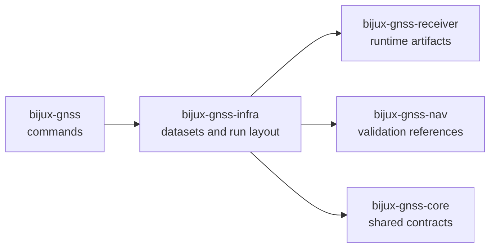

# bijux-gnss-infra

`bijux-gnss-infra` owns the repository-facing infrastructure around GNSS runs.
This crate is where datasets become typed registry entries, where runs gain a
stable identity on disk, and where experiment overrides, provenance hashing,
and artifact inspection stay explicit instead of leaking into the runtime or
the CLI.

This package matters because reproducibility is not only a receiver concern.
Some of the hardest repository questions are not about whether the signal math
worked, but about whether the run can be reconstructed, explained, and trusted
later.

## Read These First

- open [Foundation](foundation/) when the question is why infrastructure owns
  this repository-facing behavior at all
- open [Interfaces](interfaces/) when the dispute is already about datasets,
  manifests, reports, overrides, or validation-facing contracts
- open [Architecture](architecture/) when the question is structural: where
  datasets, run layout, artifact inspection, and hashing live in code
- open [Quality](quality/) when ownership is clear and the question becomes
  whether the proofs and limits are honest enough

## Why This Package Exists

- repository runs need a durable owner for datasets, manifests, reports, and
  artifact inspection
- experiment sweeps and profile overrides should be typed and reviewable rather
  than ad hoc shell logic
- provenance hashing and run identity need one infrastructure owner instead of
  being reimplemented in commands and tests

## What It Owns

- dataset registry parsing and raw-IQ metadata resolution
- run directory identity, naming, records, manifests, and history persistence
- experiment sweeps, profile overrides, and provenance hashing
- repository-facing artifact inspection and validation helpers
- infrastructure-level API composition over lower GNSS crates

## What It Refuses

- receiver scheduling and stage execution owned by `bijux-gnss-receiver`
- low-level signal and sample primitives owned by `bijux-gnss-signal`
- standalone navigation science owned by `bijux-gnss-nav`
- public command vocabulary owned by `bijux-gnss`
- cross-package semantic contracts owned by `bijux-gnss-core`

## Strongest Proof Surfaces

- crate README:
  [`crates/bijux-gnss-infra/README.md`](../../crates/bijux-gnss-infra/README.md)
- dataset, run-layout, and validation docs:
  [`crates/bijux-gnss-infra/docs/DATASETS.md`](../../crates/bijux-gnss-infra/docs/DATASETS.md),
  [`crates/bijux-gnss-infra/docs/RUN_LAYOUT.md`](../../crates/bijux-gnss-infra/docs/RUN_LAYOUT.md),
  [`crates/bijux-gnss-infra/docs/VALIDATION.md`](../../crates/bijux-gnss-infra/docs/VALIDATION.md)
- override and experiment docs:
  [`crates/bijux-gnss-infra/docs/OVERRIDES.md`](../../crates/bijux-gnss-infra/docs/OVERRIDES.md),
  [`crates/bijux-gnss-infra/docs/EXPERIMENTS.md`](../../crates/bijux-gnss-infra/docs/EXPERIMENTS.md)
- source roots:
  [`crates/bijux-gnss-infra/src/datasets`](../../crates/bijux-gnss-infra/src/datasets),
  [`crates/bijux-gnss-infra/src/run_layout`](../../crates/bijux-gnss-infra/src/run_layout),
  [`crates/bijux-gnss-infra/src/overrides`](../../crates/bijux-gnss-infra/src/overrides)
- proof tests:
  [`crates/bijux-gnss-infra/tests`](../../crates/bijux-gnss-infra/tests)

## Sections In This Handbook

- [Foundation](foundation/) for role, scope, ownership, repository fit, and
  infrastructure vocabulary
- [Architecture](architecture/) for datasets, run layout, artifact inspection,
  overrides, hashing, and dependency direction
- [Interfaces](interfaces/) for public API, dataset contracts, run footprint
  contracts, override and sweep contracts, and validation adapters
- [Operations](operations/) for safe change sequence, verification, fixture
  care, and review scope
- [Quality](quality/) for trust boundaries, invariants, limitations, risk, and
  change validation
- [This Package Does Not Own](this-package-does-not-own.md) for the explicit
  refusal ledger

## Start Here When

- the question is about registered datasets, sidecars, or raw-IQ metadata
- the issue is where a run directory, manifest, or history record comes from
- the reader needs to understand how sweeps or profile overrides are expanded
- a reviewer wants to know whether an artifact on disk is being validated at
  the right boundary

## Reader Questions This Package Can Answer

- how repository runs get stable identity and persisted structure
- why dataset and metadata resolution are infrastructure concerns rather than
  command or signal concerns
- how experiment overrides stay typed and provenance-aware
- where artifact inspection belongs after execution has finished

## Leave This Handbook When

- the question becomes about the command that invokes the workflow:
  [01-bijux-gnss](../01-bijux-gnss/)
- the question becomes about receiver artifacts produced in memory before
  persistence:
  [05-bijux-gnss-receiver](../05-bijux-gnss-receiver/)
- the question becomes about the shared artifact schema or observation meaning:
  [02-bijux-gnss-core](../02-bijux-gnss-core/)
- the question becomes about navigation reference truth or estimation logic:
  [04-bijux-gnss-nav](../04-bijux-gnss-nav/)

## First Proof Check

- `crates/bijux-gnss-infra/src/datasets/registry.rs`
- `crates/bijux-gnss-infra/src/datasets/raw_iq_metadata.rs`
- `crates/bijux-gnss-infra/src/run_layout/`
- `crates/bijux-gnss-infra/src/overrides/`
- `crates/bijux-gnss-infra/src/sweep.rs`
- `crates/bijux-gnss-infra/docs/RUN_LAYOUT.md`

## Design Pressure

If `bijux-gnss-infra` starts carrying receiver scheduling, navigation policy,
or command UX because those surfaces need repository context nearby, the
infrastructure boundary becomes a catch-all instead of a durable owner.
