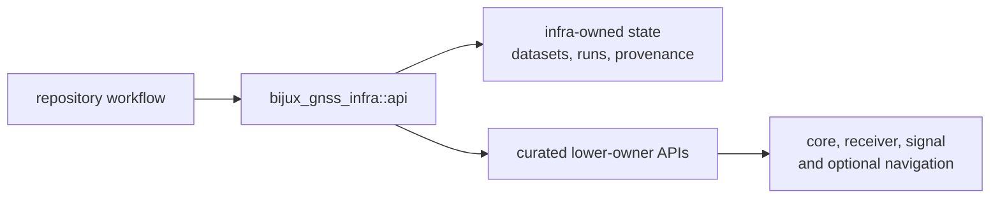

# API Surface

Use `bijux_gnss_infra::api` whenever application code needs repository-backed
GNSS infrastructure. It is the crate's only public module; every implementation
module remains private so callers depend on capabilities rather than source-tree
layout.

## What The API Offers

| family | representative surface | use it when |
| --- | --- | --- |
| datasets | `DatasetRegistry`, `DatasetEntry`, raw-IQ metadata loaders | a file-backed capture must become typed repository input |
| run footprints | `RunContextArgs`, `RunDirectoryLayout`, manifest and report writers | an execution needs deterministic placement and durable records |
| artifact inspection | `artifact_explain`, `artifact_validate` | an existing acquisition, tracking, observation, or navigation artifact must be interpreted |
| experiment controls | sweep parsers, override applicators, experiment records | one declared configuration must expand into reproducible cases |
| provenance | configuration, Git-state, and CPU-feature helpers | a report must explain the environment that produced it |
| reference alignment | `validate_reference` and alignment records | persisted solutions must be paired with reference epochs |

The optional `nav` feature adds navigation validation reports and the navigation
API re-export. Code that must compile without navigation support cannot assume
those names exist.

## Re-Exports Do Not Move Ownership

The API also exposes curated `core`, `receiver`, and `signal` surfaces, plus
`nav` when enabled. This gives repository workflows one import boundary; it does
not make infra the owner of observations, receiver state, signal definitions, or
navigation science. Follow a record to its producing package when its domain
meaning is in question.

## Admission Test

A new export belongs here only when all of these are true:

1. It represents repository state or an operation over that state.
2. More than one repository-facing workflow benefits from the same contract.
3. Its effects, errors, and feature availability can be explained at the API
   boundary.
4. The owning package still carries the domain proof when infra re-exports a
   lower-owner type.

A helper that merely saves an import, hides command policy, or moves product
logic out of its owner does not pass this test.

## Verify The Surface

Compare the [curated API source](../../../crates/bijux-gnss-infra/src/api.rs)
with the [public API contract](../../../crates/bijux-gnss-infra/docs/PUBLIC_API.md).
Use [Public Imports](public-imports.md) for caller examples and
[Compatibility Commitments](compatibility-commitments.md) before changing an
existing export.
