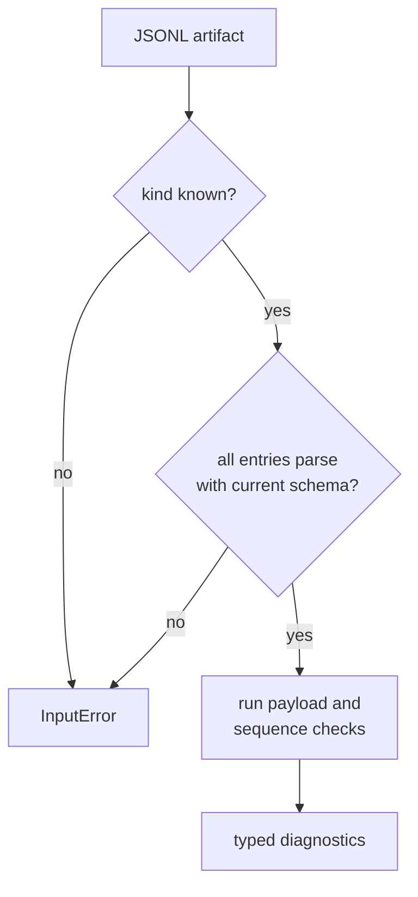

# Artifact Inspection Contracts

Artifact inspection answers two different questions about an existing JSONL
artifact:

- `artifact_explain` identifies the artifact, reads its first header, counts
  entries, and summarizes diagnostic severities.
- `artifact_validate` parses every non-empty entry and returns the diagnostics
  produced by schema, payload, ordering, and signal-level checks.

Neither function reruns the receiver or establishes scientific accuracy.

## Supported Artifacts

| kind | accepted label | validation beyond parsing |
| --- | --- | --- |
| acquisition results | `acq` | current schema and acquisition payload diagnostics |
| tracking epochs | `track` | current schema, payload diagnostics, and monotonic sample indices |
| observation epochs | `obs` | current schema, epoch diagnostics, monotonic receive time, and signal observation compatibility |
| navigation solutions | `pvt` or `nav` | current schema, payload diagnostics, and monotonic receive time |

Validation accepts an explicit kind first. Without one, it infers the kind from
the filename by looking for `acq`, `track`, `obs`, `pvt`, or `nav`.
`artifact_explain` always relies on filename inference, so give persisted
artifacts descriptive names.

## Result And Failure Semantics

An `InputError` means inspection could not establish a valid input stream:
reading failed, the kind was unsupported, JSON deserialization failed, or a
schema version was not the current supported version. Diagnostics mean the
artifact was readable but its payload or sequence raised domain concerns. Keep
these outcomes distinct in command reports.

The `strict` argument currently adds one policy: an empty artifact is an error.
With `strict = false`, a known empty artifact can validate with no diagnostics.
Callers that require evidence must therefore use strict mode or enforce their
own non-empty policy. Strict mode does not convert warnings into errors; the
caller decides which diagnostic severity should fail a workflow.

## Reading An Explanation

`ArtifactExplainResult` reports:

- the inferred kind
- the first artifact header
- the count of non-empty entries
- total, error, and warning diagnostic counts

Use the header to attribute producer, schema, configuration, dataset, build, and
determinism context. Then inspect diagnostics before trusting the entry count:
readable rows are not necessarily valid rows.

## Verification Routes

The [validation guide](../../../crates/bijux-gnss-infra/docs/VALIDATION.md)
defines the package boundary. The
[artifact inspection tests](../../../crates/bijux-gnss-infra/src/artifact_inspection/tests.rs)
prove accepted acquisition input, tracking-order diagnostics, and navigation
explanation. Review the
[artifact validator](../../../crates/bijux-gnss-infra/src/artifact_inspection/validation.rs)
when changing kind dispatch, strict-mode behavior, or schema policy.
