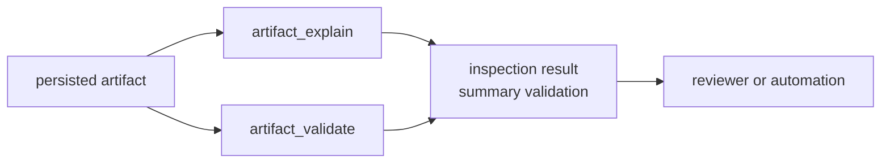

# Artifact Inspection Contracts

Artifact inspection is post-run repository interpretation. The artifact already
exists; infra explains and validates it without rerunning receiver stages,
changing navigation science, or rewriting command report meaning.

## Inspection Flow

## Owned Entry Points

| surface | purpose | ownership limit |
| --- | --- | --- |
| `artifact_explain` | summarize persisted artifact contents for repository readers | does not produce receiver evidence |
| `artifact_validate` | validate persisted artifact shape and repository-facing meaning | does not replace runtime validation |
| `ArtifactExplainResult` | carry explanation output in a typed result | does not define command report format |
| `ArtifactValidationResult` | carry validation status and evidence | does not redefine core artifact payload semantics |

## Reader Standard

An inspection result is useful when it answers:

- Which artifact was inspected?
- Which artifact kind and schema were recognized?
- Which validation path accepted, warned, or rejected it?
- Which lower owner produced the original evidence?
- Which repository context is needed to interpret it later?

## First Proof Check

Inspect `crates/bijux-gnss-infra/docs/VALIDATION.md`,
`crates/bijux-gnss-infra/src/artifact_inspection/summary.rs`,
`crates/bijux-gnss-infra/src/artifact_inspection/validation.rs`,
`crates/bijux-gnss-infra/src/artifact_inspection/tests.rs`, and the artifact
validation modules under `crates/bijux-gnss-infra/src/artifact_inspection/validation/`.
