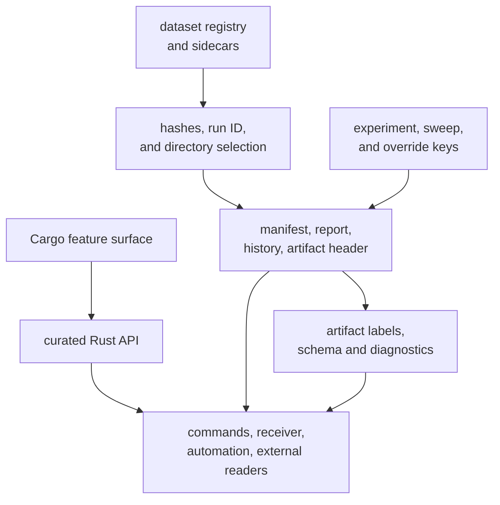
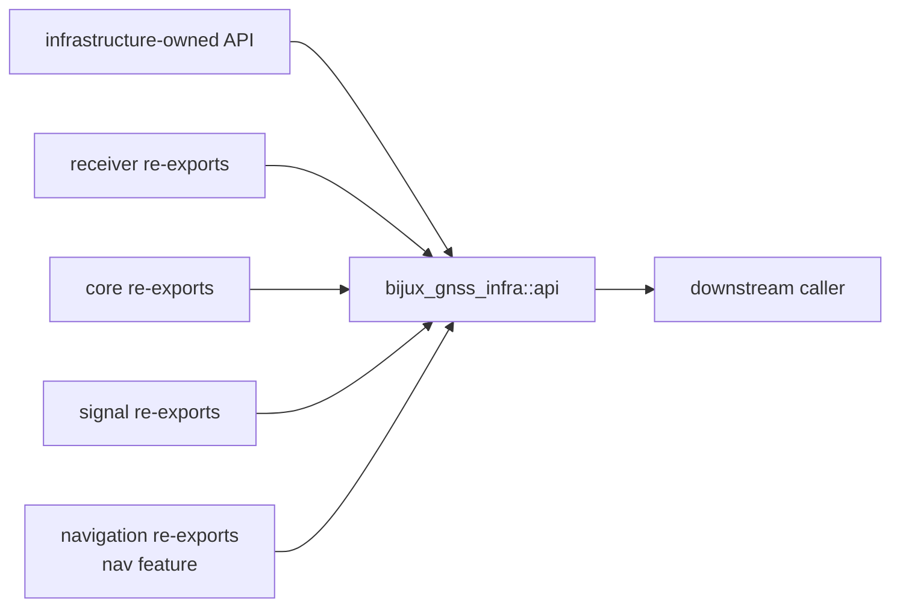
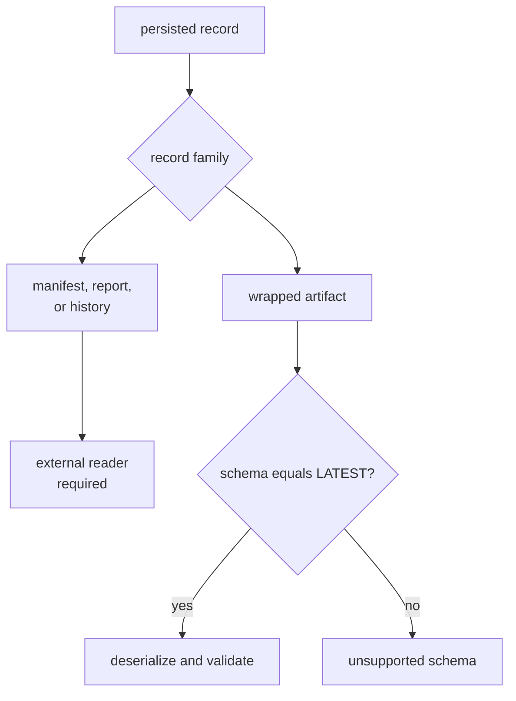

# Infrastructure Compatibility

Infrastructure compatibility is the ability to interpret repository state
without guessing what a record, identifier, feature, or path meant when it was
created. It is not a blanket promise that every historical file can be read by
the current crate. This page distinguishes current guarantees from version
markers that do not yet have migration machinery behind them.

## Compatibility Surfaces

| Surface | Compatibility-sensitive behavior |
| --- | --- |
| curated API | exported names, signatures, type identity, ownership, and feature availability |
| dataset input | TOML field names, enum spelling, required fields, path normalization, metadata precedence, and validation |
| run identity | hash algorithm, serialized inputs, package-version input, deterministic timestamp behavior, and default directory naming |
| persisted records | JSON field names and types, schema values, JSONL framing, and append behavior |
| artifacts | kind labels, filename inference, wrapped payload schema, diagnostics, and rejection policy |
| experiments and overrides | serialized fields, sweep grammar, Cartesian ordering, supported keys, and value parsing |

## Public API and Features

The supported Rust entrypoint is `bijux_gnss_infra::api`. Internal module paths
are not compatibility surfaces. The API directly owns dataset, run-layout,
artifact-inspection, variation, hashing, and repository-facing validation
helpers. Selected core, signal, receiver, and navigation items are re-exported
for convenience; their defining crates still own their semantics.

The default feature set includes `nav`. Disabling default features removes the
navigation re-export family and navigation validation helpers. The
`precise-products` and `tracing` features pass corresponding capability into
the receiver dependency. A consumer that needs a feature-gated item must name
that feature; private availability in one workspace build is not a stable API
promise.

Review these as compatibility changes:

- removing, renaming, or changing a curated export
- moving an item behind a feature or changing the default feature set
- re-exporting a lower-owned type under a different identity
- changing an error from a typed rejection into a panic, silent fallback, or
  unrelated message

## Dataset and Sidecar Compatibility

`DatasetRegistry` deserializes a required `version` and a non-empty list of
entries. The current loader stores the version but does not branch on it or
reject an unsupported value. The field is therefore a recorded marker, not an
enforced migration policy.

Dataset identity, capture location, sample format, and `expected_sats` are
required. Fields represented as `Option`, including recorded-capture
provenance, may be absent and deserialize as `None`. Adding a required field can
make existing registries unreadable; adding optional data still needs an
old-input test so the intended default is explicit.

Raw-IQ sidecars require format, sample rate, intermediate frequency, and capture
start. Offset, quantization depth, and notes have defaults. Registry-side paths
are normalized relative to the registry before callers receive the entry.
Changes to normalization can alter the serialized dataset, dataset hash, run
ID, and persisted evidence even when the capture bytes do not change.

Compatibility review is required for:

- registry or sidecar field names, requiredness, types, defaults, and enum
  spellings
- path anchoring or normalization
- source precedence and disagreement checks
- the meaning of expected satellites, region, time, or recorded provenance
- raw-IQ format, sample scaling, offsets, or quantization interpretation

## Run Identity and Layout

The run ID is derived from the configuration hash, optional normalized dataset
hash, and package version. It excludes command, Git state, CPU features, and
timestamp. The default run directory adds dataset label and command; a
non-deterministic run also adds a timestamp. Explicit output or resume arguments
select their supplied location instead.

Consequently:

- changing profile serialization can change configuration hashes
- changing dataset serialization or normalization can change dataset hashes
- changing package version changes run IDs for otherwise identical inputs
- deterministic mode sets generated timestamps to zero but does not prove
  cross-machine reproducibility
- directory spelling is not a safe substitute for reading the run report or
  manifest

Hash inputs and directory-selection rules are compatibility surfaces because
automation may group, resume, or compare runs with them. If they change, record
the new identity semantics and provide an explicit boundary between old and new
records.

## Persisted Record Reality

The current crate writes:

- a run manifest with layout schema version `1`
- a run report with report schema version `1` and layout schema version `1`
- append-only JSON Lines history entries
- shared versioned artifact wrappers

The version fields do not by themselves provide backward compatibility.
`RunManifest`, `RunReport`, and `RunHistoryEntry` currently derive serialization
only; infrastructure does not publish deserializers or migrations for them.
Changing their shape can break external readers even if repository Rust code
still compiles.

Artifact inspection does deserialize wrapped payloads, but it accepts exactly
the current `ArtifactReadPolicy::LATEST` schema. Older and newer schema values
are rejected. There is no compatibility window or migration path in the
inspector today.

Do not claim historical run readability until a reader and migration policy
exist and are tested. A future persisted-record change should choose one of
these explicit strategies:

1. Preserve the existing serialized shape.
2. Add defaulted optional data while proving old input remains readable through
   a real reader.
3. Introduce a new schema version and provide migration or side-by-side readers.
4. Declare the old record unsupported and give readers an exact archival or
   regeneration path.

Silently changing fields while leaving the version unchanged is not an
acceptable strategy.

## Artifact Kind and Validation Behavior

Artifact validation recognizes acquisition, tracking, observation, and
position/navigation families. An explicit kind label takes precedence; without
one, the kind is inferred from the filename. Explanation currently relies on
filename inference. Renaming files can therefore change whether the same
payload is recognized.

Validation parses every non-empty JSONL entry, enforces the latest schema, and
returns payload diagnostics. Strict mode adds rejection of an entirely empty
file; it does not select a broader schema policy or turn warnings into errors.
Changes to labels, filename patterns, schema acceptance, diagnostic severity,
or empty-file behavior are reader-facing compatibility changes.

## Experiment and Override Compatibility

Sweep parsing accepts `key=value1,value2`; expansion preserves parameter and
value order while producing the Cartesian product. An empty specification
produces one empty override set. Application, not expansion, decides which keys
and values are supported.

Serialized `ExperimentSpec` and `SweepParameter` fields, sweep key strings, and
enumerated value spellings are durable inputs. Renaming
`navigation.weighting.mode`, for example, breaks stored experiment
specifications and command automation even if the receiver field itself still
exists.

## Change Checklist

Before changing infrastructure state:

1. Name every affected reader: Rust caller, registry loader, sidecar loader,
   run automation, JSON/JSONL reader, artifact inspector, or sweep consumer.
2. Identify whether the change affects meaning, serialized shape, identity,
   location, feature availability, or only private implementation.
3. Inspect existing records rather than assuming the schema marker makes them
   readable.
4. Add old-input and new-input cases when claiming compatibility.
5. Test rejected versions, missing required fields, unknown labels, malformed
   payloads, and unsupported sweep keys.
6. Follow changed hashes or normalized paths through run ID and directory
   selection.
7. Record unsupported history honestly when no migration exists.

## Compatibility References

- [Public API contract](../../../crates/bijux-gnss-infra/docs/PUBLIC_API.md)
  identifies direct exports and lower-owned re-exports.
- [Dataset contract](../../../crates/bijux-gnss-infra/docs/DATASETS.md) explains
  registry and metadata resolution.
- [Run layout contract](../../../crates/bijux-gnss-infra/docs/RUN_LAYOUT.md)
  describes persisted execution state.
- [Artifact validation boundary](../../../crates/bijux-gnss-infra/docs/VALIDATION.md)
  explains post-run inspection ownership.
- [Override contract](../../../crates/bijux-gnss-infra/docs/OVERRIDES.md) and
  [experiment contract](../../../crates/bijux-gnss-infra/docs/EXPERIMENTS.md)
  cover variation inputs.
- [Infrastructure guardrails](../../../crates/bijux-gnss-infra/tests/integration_guardrails.rs)
  protect package structure; they do not prove persisted compatibility.
