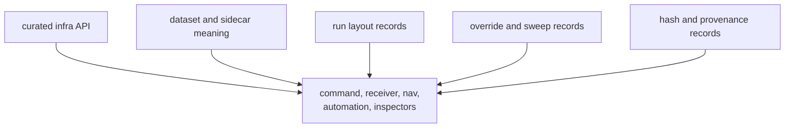

# Compatibility Commitments

Infra compatibility means repository-state readers can continue to interpret
datasets, run footprints, persisted artifacts, provenance, overrides, and sweep
evidence without importing private module layout or command-only behavior.

## Compatibility Surface

## Commitments

| surface | stable promise | allowed evolution |
| --- | --- | --- |
| curated API | callers enter through `bijux_gnss_infra::api` and documented commands | additive exports with documented ownership |
| dataset interpretation | registry and raw-IQ metadata carry one repository meaning | new fields with validation and backward-readable defaults |
| run footprint | manifests, reports, history, and artifact headers remain inspectable | versioned fields or explicit migration guidance |
| overrides and sweeps | parameters stay typed and reviewable | new parameter families with tests and docs |
| provenance and hashes | evidence names the input and context being hashed | broader evidence only when the hash meaning remains explicit |

## Non-Commitments

- Private module paths are not public compatibility.
- Command UX is not infra compatibility unless it changes repository-state
  meaning.
- Receiver runtime policy, signal math, and navigation science remain with their
  owning crates.
- Convenience re-exports do not make lower-level behavior infra-owned.

## First Proof Check

Inspect `crates/bijux-gnss-infra/docs/CONTRACTS.md`,
`crates/bijux-gnss-infra/docs/PUBLIC_API.md`,
`crates/bijux-gnss-infra/docs/RUN_LAYOUT.md`,
`crates/bijux-gnss-infra/docs/OVERRIDES.md`,
`crates/bijux-gnss-infra/docs/HASHING.md`, and
`crates/bijux-gnss-infra/tests/integration_guardrails.rs`.
