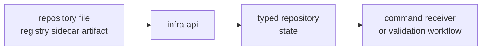

# Entrypoints and Examples

The best infra examples are repository-state examples. Start here when the
question is about datasets, sidecars, run directories, persisted artifacts,
provenance, sweeps, overrides, or reference comparison after evidence exists.

## Entrypoint Flow



## Starting Points

| reader need | public entrypoint | first owner to inspect |
| --- | --- | --- |
| load dataset registry | `DatasetRegistry::load` | dataset docs |
| load or resolve raw-IQ metadata | `load_raw_iq_metadata`, `resolve_raw_iq_metadata` | signal metadata plus dataset docs |
| build run footprint | `run_dir`, `artifacts_dir`, `write_manifest`, `write_run_report` | run-layout docs |
| expand experiment matrix | `parse_sweep`, `expand_sweep` | experiment and override docs |
| explain or validate artifact | `artifact_explain`, `artifact_validate` | artifact inspection docs |
| compare reference output | `validate_reference` | validation docs |
| attach provenance | `hash_config`, `git_hash`, `git_dirty`, `cpu_features` | hashing docs |

## Example: Load a Dataset Registry

```rust
use std::path::Path;
use bijux_gnss_infra::api::DatasetRegistry;

let registry = DatasetRegistry::load(Path::new("datasets/registry.toml"))?;
```

## Example: Expand a Sweep

```rust
use bijux_gnss_infra::api::expand_sweep;

let spec = vec![
    ("sampling_hz".to_string(), vec!["1023000".to_string(), "4092000".to_string()]),
];
let cases = expand_sweep(&spec);
```

## Example: Validate Persisted References

```rust
use bijux_gnss_infra::api::{validate_reference, ReferenceAlign};

let _aligned = validate_reference(&solutions, &reference_epochs, ReferenceAlign::Closest)?;
```

These examples stay small on purpose. The crate's public value is typed
repository interpretation, not full workflow narration. Commands and receiver
stages should call these entrypoints rather than duplicating registry parsing,
run-layout construction, or persisted validation rules.

## First Proof Check

Inspect `crates/bijux-gnss-infra/src/api.rs`,
`crates/bijux-gnss-infra/docs/PUBLIC_API.md`,
`crates/bijux-gnss-infra/docs/CONTRACTS.md`, and the most relevant dataset,
run-layout, or validation tests to confirm these examples still match real
repository entrypoints.
