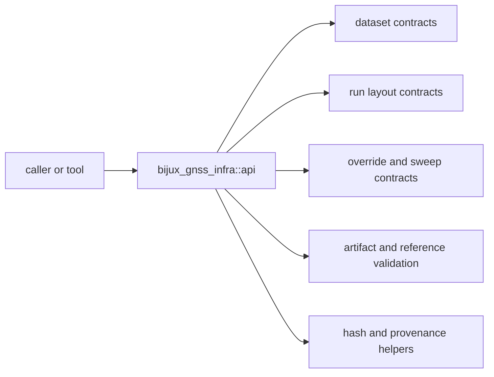

# Interfaces

Open this section when the question is contractual: which repository-facing
records, manifests, overrides, validation adapters, and public imports are safe
for another crate or tool to rely on.

## Contract Surface

`bijux-gnss-infra` exposes one curated public surface, but it carries several
different contract families: datasets, run footprints, artifact inspection,
override and sweep behavior, provenance helpers, and validation adapters that
turn persisted evidence back into reviewable comparisons.

## Read These First

- open [API Surface](api-surface.md) first when the question is whether a
  helper or type should be part of the public infra boundary
- open [Run Footprint Contracts](run-footprint-contracts.md) when the issue is
  manifests, reports, history, or artifact headers
- open [Dataset Contracts](dataset-contracts.md) when the dispute starts from
  the registry, sidecars, or capture provenance

## First Proof Check

- `crates/bijux-gnss-infra/src/api.rs`
- `crates/bijux-gnss-infra/docs/CONTRACTS.md`
- `crates/bijux-gnss-infra/docs/DATASETS.md`
- `crates/bijux-gnss-infra/docs/RUN_LAYOUT.md`

## Pages In This Section

- [API Surface](api-surface.md)
- [Public Imports](public-imports.md)
- [Dataset Contracts](dataset-contracts.md)
- [Run Footprint Contracts](run-footprint-contracts.md)
- [Artifact Inspection Contracts](artifact-inspection-contracts.md)
- [Override and Sweep Contracts](override-and-sweep-contracts.md)
- [Provenance and Hashing](provenance-and-hashing.md)
- [Validation Adapters](validation-adapters.md)
- [Entrypoints and Examples](entrypoints-and-examples.md)
- [Compatibility Commitments](compatibility-commitments.md)

## Leave This Section When

- leave for [Foundation](../foundation/) when the contract dispute is really a
  package-boundary dispute
- leave for [Architecture](../architecture/) when the interface issue reveals
  structural drift underneath it
- leave for [Operations](../operations/) or [Quality](../quality/) when the
  contract is clear and the question becomes safe change or proof
