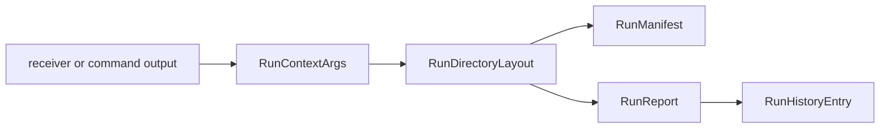

# Persisted Artifact Contracts

`bijux-gnss-infra` owns the repository footprint of GNSS evidence after a run:
directory layout, manifest records, run reports, history entries, provenance
capture, and infrastructure-side artifact headers.

Product crates may create in-memory artifacts. Infra decides how repository
runs name, persist, and later inspect those artifacts.

## Persistence Flow

## Contract Families

| family | owns | first proof |
| --- | --- | --- |
| run context | run id, output root, dataset id, deterministic seed, and caller-provided context | [run layout guide](../../../crates/bijux-gnss-infra/docs/RUN_LAYOUT.md) and run-layout source |
| directory layout | deterministic run and artifact path resolution | run-layout source |
| manifests | persisted run identity and artifact inventory | run-layout record source |
| reports | repository-readable run summaries | run-layout record source |
| history | append-only run history entries for later inspection | run-layout record source |
| artifact headers | infrastructure-side persistence metadata around core artifact meaning | run-layout source |

## Boundary Rules

- Core owns shared artifact payload meaning; infra owns persisted run footprint
  and repository interpretation.
- Receiver owns runtime artifacts before persistence; infra owns how those
  artifacts are placed under a run directory.
- Commands may request output locations; infra owns deterministic layout and
  history semantics.
- Tests should prove old persisted evidence remains understandable when writer
  or reader code changes.

## Reader Checks

Before changing this surface, answer:

- Will an existing run directory still be explainable?
- Does the manifest still identify what was produced and why?
- Does path resolution stay deterministic for the same run context?
- Can a reader distinguish raw runtime evidence from repository metadata?

## First Proof Check

Inspect the [run layout guide](../../../crates/bijux-gnss-infra/docs/RUN_LAYOUT.md),
[infra contract guide](../../../crates/bijux-gnss-infra/docs/CONTRACTS.md),
run-layout source, run-layout record source, and run-layout or
artifact-inspection integration tests before changing persisted evidence claims.
