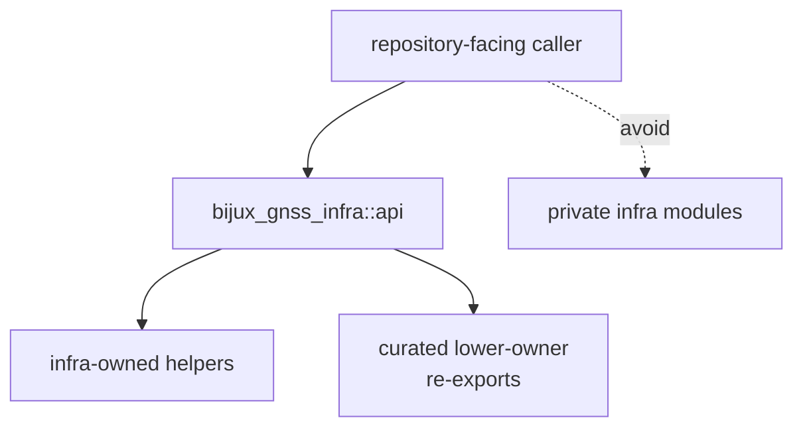

# Public Imports

Callers should import repository-facing helpers through `bijux_gnss_infra::api`
rather than reaching into private module paths. Infra also exposes selected
lower-owner re-exports when a caller is working through the repository-facing
boundary.

## Import Route



## Import Families

| family | import through `api` for | owner |
| --- | --- | --- |
| datasets | registry loading, raw-IQ sidecar resolution, coordinates, and capture provenance | infra |
| run layout | run directories, manifests, reports, artifact headers, and history entries | infra |
| experiments and overrides | sweep expansion and typed profile mutation | infra |
| artifacts | persisted artifact explanation and validation entrypoints | infra plus core payload meaning |
| provenance | config hashes, git state, dirty-state evidence, and CPU feature evidence | infra |
| reference validation | repository-facing comparison over persisted or loaded results | infra bridge over receiver validation |
| receiver, core, signal, nav re-exports | one-boundary repository workflows that need lower-owner public APIs | lower crates |

## Import Rule

If a caller needs a private infra module path directly, that is either a sign
that the public surface is incomplete or that the caller is reaching past the
repository contract.

## Good Import Shape

```rust
use bijux_gnss_infra::api::{DatasetRegistry, RunManifest, expand_sweep};
```

## Bad Import Shape

```rust
use bijux_gnss_infra::run_layout::records::RunManifest;
```

The second style couples callers to file layout instead of to the stable
infrastructure surface.

## Review Checks

- Is the caller interpreting repository state rather than receiver runtime
  internals?
- Does the import make the infra boundary visible in code review?
- Is a lower-owner re-export improving one coherent repository workflow, or is
  it hiding an ownership mistake?
- Would a run-layout refactor break this caller unnecessarily?
- Does the public API doc mention the family that the caller imports?

## First Proof Check

Inspect `crates/bijux-gnss-infra/src/api.rs`,
`crates/bijux-gnss-infra/docs/PUBLIC_API.md`, and
`crates/bijux-gnss-infra/tests/integration_guardrails.rs` to confirm the
import families documented here still match the curated public surface.
