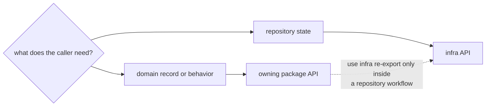

# Public Imports

Import repository-facing helpers through `bijux_gnss_infra::api`. The crate
keeps implementation modules private, so a direct import from an internal module
is not an alternative API style: it is unavailable to downstream callers.

## Choose The Import By Meaning



| caller need | preferred import | reason |
| --- | --- | --- |
| load a registry or raw-IQ sidecar | `bijux_gnss_infra::api::{DatasetRegistry, load_raw_iq_metadata}` | infra owns file-backed dataset interpretation |
| create a run footprint | `bijux_gnss_infra::api::{RunContextArgs, run_dir, write_manifest}` | infra owns deterministic placement and persistence |
| inspect a persisted artifact | `bijux_gnss_infra::api::{artifact_explain, artifact_validate}` | infra owns post-run repository interpretation |
| configure a receiver directly | `bijux_gnss_receiver::api` | receiver configuration is a product contract |
| use units or shared records directly | `bijux_gnss_core::api` | core owns cross-package semantic types |
| combine repository state with receiver records | the curated `receiver` or `core` re-export under the infra API | one import boundary can clarify a cohesive infrastructure workflow |

## Example: Repository-Owned State

```rust
use bijux_gnss_infra::api::{DatasetRegistry, expand_sweep};
```

Both names describe infrastructure work: loading registered inputs and
expanding declared experiment cases.

## Example: Domain-Owned State

```rust
use bijux_gnss_receiver::api::ReceiverConfig;
```

Use the receiver API when the surrounding code configures or executes receiver
behavior. Importing the same type through infra would obscure the real owner.

## When An Export Is Missing

Do not work around a missing export by copying parsing, path construction, or
persistence logic into a caller. First decide whether the capability represents
shared repository state:

- If yes, propose a narrow infra export with a contract and protecting proof.
- If no, add it to the package that owns the behavior.
- If only one command needs it, keep it in that command until a shared contract
  actually exists.

## Review Checks

- Does the import reveal which package owns the meaning?
- Would moving private source files leave the caller unchanged?
- Is a lower-owner re-export supporting one coherent repository workflow?
- Is feature-gated navigation code guarded by the same `nav` feature?
- Does the [public API contract](../../../crates/bijux-gnss-infra/docs/PUBLIC_API.md)
  describe the imported family?

The [curated API source](../../../crates/bijux-gnss-infra/src/api.rs) is the
authoritative export list. The
[infra boundary test](../../../crates/bijux-gnss-infra/tests/integration_guardrails.rs)
protects repository shape, but it does not prove the behavior of every export;
use the owning family’s tests for that claim.
