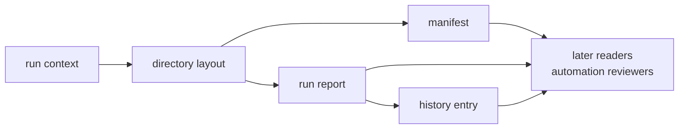

# Run Footprint Contracts

Run-footprint contracts are the repository memory of an execution. They define
how a run context becomes directories, manifests, reports, artifact headers, and
history entries that remain readable after the command process exits.

## Footprint Flow

## Owned Records And Helpers

| surface | role | compatibility expectation |
| --- | --- | --- |
| `RunContextArgs` | captures inputs that determine a run footprint | same context resolves predictably |
| `RunDirectoryLayout` | names repository directories for run output | paths stay explainable without command memory |
| `RunManifest` | records durable run identity and inputs | old manifests remain interpretable |
| `RunReport` | records high-level run outcome and evidence pointers | report fields preserve repository meaning |
| `RunHistoryEntry` | appends run evidence into repository history | history supports later indexing and audit |
| `artifact_header` | bridges core artifact shape into infra persistence | header meaning stays aligned with core |
| `write_manifest`, `write_run_report`, `append_run_history_entry` | persistence operations | writes are explicit and reviewable |

## Boundary Decisions

- Receiver and nav produce runtime or science evidence before persistence.
- Infra records where evidence lives and how later readers find it.
- Command code may select output intent but does not define run layout.
- Core owns artifact payload meaning; infra owns repository placement.

## First Proof Check

Inspect `crates/bijux-gnss-infra/docs/RUN_LAYOUT.md`,
`crates/bijux-gnss-infra/src/run_layout.rs`,
`crates/bijux-gnss-infra/src/run_layout/directories/`,
`crates/bijux-gnss-infra/src/run_layout/records/`,
`crates/bijux-gnss-infra/src/run_layout/persistence.rs`, and run-layout tests.
