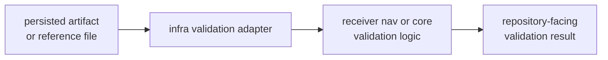

# Validation Adapters

Validation adapters bridge persisted evidence and reference comparison flows.
They prepare repository-facing validation calls without taking ownership of the
receiver algorithms, navigation science, or core record semantics being
validated.

## Adapter Flow

## Owned Entry Points

| surface | repository role | lower owner retained |
| --- | --- | --- |
| `validate_reference` | aligns persisted/reference epochs for CLI and infra workflows | receiver owns alignment behavior |
| curated API re-exports | expose validation helpers through infra when repository workflows need them | original crate owns validation meaning |
| artifact validation adapters | load and route persisted artifacts into typed validation | core owns payload semantics |

## Review Questions

- Is the input already persisted evidence, a manifest, sidecar, or reference
  file?
- Does the adapter preserve the lower owner’s validation meaning?
- Could this logic live in receiver without repository context? If yes, keep it
  in receiver.
- Does command code need only a route and report, not validation ownership?

## First Proof Check

Inspect `crates/bijux-gnss-infra/docs/VALIDATION.md`,
`crates/bijux-gnss-infra/src/validate_reference.rs`,
`crates/bijux-gnss-infra/src/artifact_inspection/validation.rs`,
`crates/bijux-gnss-infra/src/api.rs`, and the closest infra validation tests.
