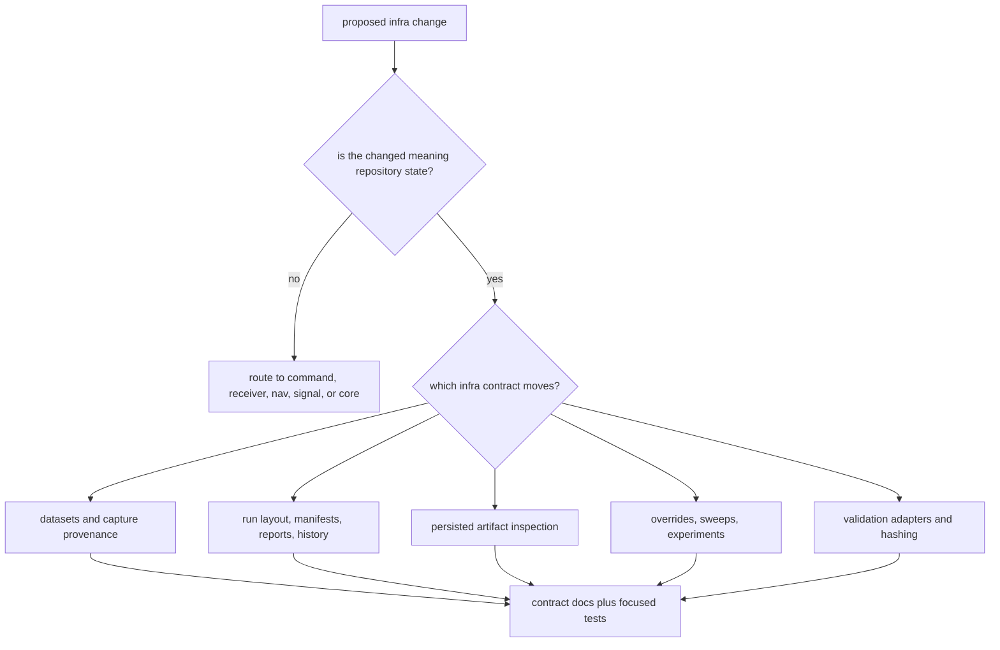

# Change Sequence

Use this sequence when a change affects repository state: dataset identity,
run-directory layout, persisted manifests, artifact inspection, overrides,
sweeps, hashes, or infrastructure-side validation adapters. Infra work should
make repository evidence easier to trust, not make product behavior harder to
find.

## Decision Flow

## Change Sequence

1. Decide whether the changed meaning is repository state rather than product
   behavior.
2. Identify the contract family in `crates/bijux-gnss-infra/docs/CONTRACTS.md`.
3. Read the owning crate-local page: `DATASETS.md`, `RUN_LAYOUT.md`,
   `OVERRIDES.md`, `EXPERIMENTS.md`, `HASHING.md`, or `VALIDATION.md`.
4. Update docs when path semantics, persisted shape, provenance, validation
   meaning, or public imports move.
5. Run the narrowest protecting infra test.
6. Only then inspect command or receiver fallout.

## Proof Selection

| changed family | first proof |
| --- | --- |
| overrides and profile mutation | `cargo test -p bijux-gnss-infra --test integration_overrides` |
| workspace layering and public shape | `cargo test -p bijux-gnss-infra --test integration_guardrails` |
| run layout or manifest meaning | `crates/bijux-gnss-infra/docs/RUN_LAYOUT.md` plus the changed source family and any available integration proof |
| dataset registry or capture provenance | `crates/bijux-gnss-infra/docs/DATASETS.md` plus the changed source family and any available integration proof |
| validation or hashing bridge | `crates/bijux-gnss-infra/docs/VALIDATION.md` or `HASHING.md` plus the changed source family |

Skipping the ownership question leaves permanent infra debt. A repository
contract should exist because multiple workflows must read the same state, not
because a product crate needed a convenient helper.
