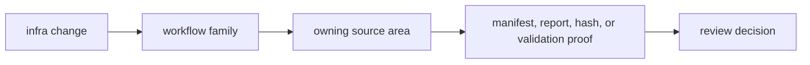

# Common Workflows

Most infra changes fall into one of five workflow families.

## Workflow Flow

## Dataset Interpretation Change

You are changing registry parsing, sidecar lookup, coordinate parsing, or
capture provenance handling. Treat it as shared repository behavior, not one
command fix.

## Run Footprint Change

You are changing run identity, manifest shape, report shape, history entries,
or artifact header behavior. This is a durability-sensitive change.

## Override Or Sweep Change

You are changing how maintained configs become run variants. Review typed
variation behavior first, not just caller ergonomics.

## Artifact Inspection Change

You are changing how persisted artifacts are explained or validated after
execution. Keep the distinction from runtime validation explicit.

## Provenance Change

You are changing hash capture or reproducibility evidence. Review whether the
change affects how future runs are compared or audited.

## Workflow Matrix

| family | source area | review focus |
| --- | --- | --- |
| dataset interpretation | `src/datasets/` | typed metadata, sidecars, coordinates, and provenance |
| run footprint | `src/run_layout/` | deterministic paths, manifests, reports, and history |
| override or sweep | `src/overrides/`, `src/sweep.rs` | typed variation and rejected inputs |
| artifact inspection | `src/artifact_inspection/` | post-run explanation versus runtime validation |
| provenance | `src/hash/` | reproducibility, comparison, and audit evidence |

## Review Checks

- Which workflow family owns the change?
- Does the evidence prove repository meaning rather than caller convenience?
- Did docs and examples change when persisted behavior changed?
