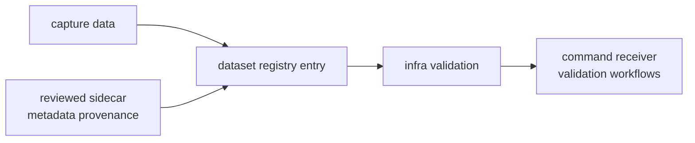

# Dataset Registration

Dataset registration turns repository captures and sidecars into typed dataset
identity. Register a dataset here when multiple commands, receiver runs, tests,
or validation workflows need the same capture to resolve with the same metadata
and provenance.

## Registration Flow

## Registration Contract

| input | required decision | owned by |
| --- | --- | --- |
| dataset identity | stable name, capture role, and lookup path | infra registry |
| raw-IQ metadata | sample rate, format, quantization, signal hints, and sidecar source | infra and signal contracts |
| coordinates | one repository parse rule for ECEF or related coordinates | infra parsing |
| provenance | reviewed source, front-end context, or notes needed for replay | infra provenance |
| validation | registry and sidecar checks before higher workflows rely on it | infra validation |

## Change Rules

- Register the dataset only when the capture is meant to be reused.
- Keep metadata explicit enough that a later receiver run does not need command
  memory to explain the input.
- Do not encode receiver lock policy, signal model assumptions, or navigation
  science in the registry entry.
- Update validation expectations when a sidecar field becomes required.

## First Proof Check

Inspect `crates/bijux-gnss-infra/docs/DATASETS.md`,
`crates/bijux-gnss-infra/src/datasets/registry.rs`,
`crates/bijux-gnss-infra/src/datasets/raw_iq_metadata.rs`,
`crates/bijux-gnss-infra/src/parse/coordinates.rs`, and the most relevant
dataset parsing, sidecar, or registry tests.
