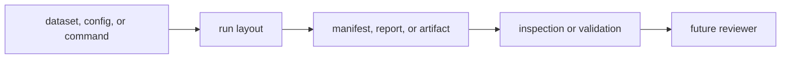

# Fixture and Artifact Care

Infra is the crate most likely to change how repository artifacts are arranged
or interpreted. That makes artifact care part of ordinary change discipline.

## Artifact Care Flow

## Care Rules

- treat manifests, reports, and history entries as durable evidence
- change run-footprint meaning only with explicit documentation updates
- if artifact interpretation changes, explain whether the payload meaning or
  only the repository-facing reading changed
- avoid casual churn in examples or checked-in footprint expectations

## Care Matrix

| changed surface | reader risk | required evidence |
| --- | --- | --- |
| manifest field | old runs become ambiguous | compatibility note or validation proof |
| report field | reviewers misread command outcome | example output or report assertion |
| history entry | audit/index consumers drift | append behavior proof |
| artifact inspection | persisted payloads are interpreted differently | before/after validation explanation |

## Why This Matters

Repository artifacts are often read long after the command and process that
created them are gone. A sloppy infra change can make old evidence harder to
trust without any compiler error.

## First Proof Check

- `crates/bijux-gnss-infra/docs/RUN_LAYOUT.md`
- `crates/bijux-gnss-infra/docs/VALIDATION.md`
- `crates/bijux-gnss-infra/src/run_layout/persistence.rs`

## Review Checks

- Can a future reviewer understand which input produced the artifact?
- Does the change preserve old evidence or document why interpretation changed?
- Are generated outputs still routed to governed repository locations?
