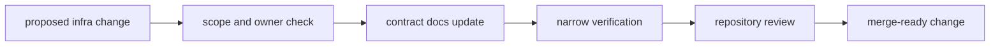

# Operations

Open this section when the question is how to change `bijux-gnss-infra`
without destabilizing repository footprints, dataset interpretation, or
validation behavior.

## Operational Model

Infra changes often look harmless because they are "only" about files or
manifests. In practice they can silently rewrite repository memory, so the
change sequence has to stay explicit.

## Read These First

- open [Change Sequence](change-sequence.md) first when the work touches
  datasets, run layout, overrides, or validation adapters
- open [Verification Commands](verification-commands.md) when you need the
  minimum executable proof for an infra change
- open [Fixture and Artifact Care](fixture-and-artifact-care.md) when the
  change touches persisted footprints or artifact interpretation

## First Proof Check

- `crates/bijux-gnss-infra/README.md`
- `crates/bijux-gnss-infra/docs/TESTS.md`
- `crates/bijux-gnss-infra/tests/`

## Pages In This Section

- [Common Workflows](common-workflows.md)
- [Local Development](local-development.md)
- [Change Sequence](change-sequence.md)
- [Verification Commands](verification-commands.md)
- [Fixture and Artifact Care](fixture-and-artifact-care.md)
- [Review Scope](review-scope.md)
- [Release and Versioning](release-and-versioning.md)

## Leave This Section When

- leave for [Interfaces](../interfaces/) when the question is what infra
  promises rather than how to change it safely
- leave for [Quality](../quality/) when the operational sequence is clear and
  the question becomes proof sufficiency
