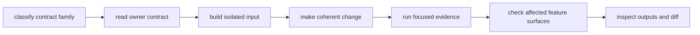
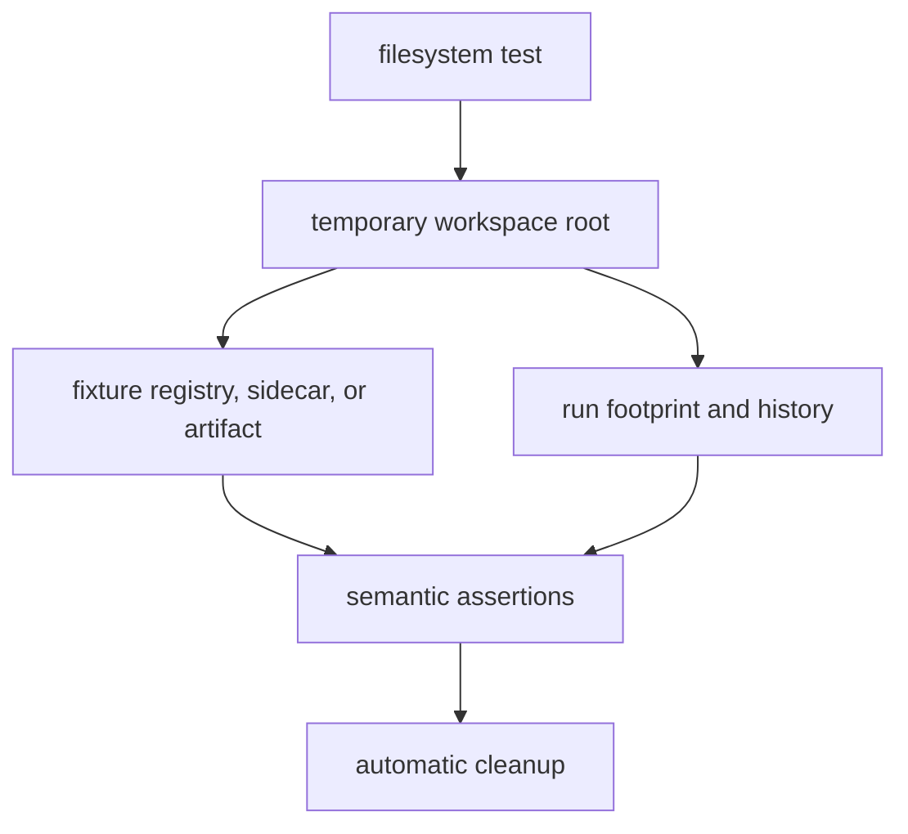

# Infrastructure Development Workflow

Work from the repository contract inward. Infrastructure code has filesystem,
process, feature, and provenance effects that a broad green test run can hide.
The fastest reliable loop is a focused fixture, a narrow assertion, and an
explicit compatibility decision.

## Development Loop



1. Identify whether the change belongs to datasets, run layout, artifacts,
   overrides, provenance, or a validation adapter.
2. Read the matching contract from the
   [infrastructure architecture](../../../crates/bijux-gnss-infra/docs/ARCHITECTURE.md)
   and state the invariant that must remain true.
3. Create the smallest representative input in an isolated temporary directory.
4. Exercise both accepted and contradictory input before broadening the change.
5. Run the narrow evidence that owns the behavior.
6. Check feature variants when public exports or receiver/navigation bridges
   move.
7. Inspect generated records as a future reader, then inspect the final diff.

## Safe Test State



Use temporary directories for registry files, sidecars, captures, run layouts,
manifests, reports, and history. Pass an explicit temporary output through
`RunContextArgs::out`; this also prevents reuse of the process-wide default
run-context cache.

Tests that mutate environment variables must restore prior values and avoid
parallel interference. `write_run_report` sets `BIJUX_RUN_ID`; assertions around
that behavior need process-global-state discipline.

Manifest persistence needs stronger isolation. `write_manifest` appends history
relative to the process working directory, even when the run output is
explicit. Exercise that complete path in a subprocess whose working directory
is the temporary root. Do not change the parent test process working directory
in a parallel suite, and never let a test append to the developer's real run
history.

Fixtures should expose the contract:

- dataset fixtures include format, sample rate, intermediate frequency,
  timestamp, location, and provenance where applicable;
- run fixtures distinguish deterministic identity inputs from timestamps and
  build metadata;
- artifact fixtures include a coherent header and one deliberately invalid
  semantic condition;
- override fixtures include an accepted key and rejected key or value;
- provenance fixtures make ordering and omitted inputs observable.

## Focused Verification

Run commands from the repository root. Use a name filter for module-owned
behavior:

```sh
cargo test -p bijux-gnss-infra dataset_registry
cargo test -p bijux-gnss-infra raw_iq_metadata
cargo test -p bijux-gnss-infra artifact_
cargo test -p bijux-gnss-infra front_end_provenance
```

Use dedicated integration targets for their actual scope:

```sh
cargo test -p bijux-gnss-infra --test integration_overrides
cargo test -p bijux-gnss-infra --test integration_guardrails
```

After focused evidence passes, run the package suite when the change spans
multiple infrastructure families:

```sh
cargo test -p bijux-gnss-infra
```

The guardrail target proves repository structure and policy alignment. It does
not prove persistence, dataset interpretation, or artifact semantics.

## Feature Checks

The default package enables navigation integration. Changes to re-exports,
validation adapters, or receiver-facing types should also compile without
default features:

```sh
cargo check -p bijux-gnss-infra
cargo check -p bijux-gnss-infra --no-default-features
cargo check -p bijux-gnss-infra --all-features
```

Do not add an unconditional import to satisfy the default build if it breaks the
feature-disabled boundary. Document unavailable behavior instead of creating a
stub that appears functional.

## Workflow-Specific Guidance

### Dataset Or Sidecar Change

Use a registry beside its test data so relative-location behavior is visible.
Test precedence when both registry and sidecar provide metadata. Reject
incompatible quantization, missing rates or frequencies, and missing timestamps
rather than guessing.

### Run Footprint Change

Assert the resolved layout before writing. After persistence, inspect manifest,
report, history, and environment effects separately. Verify repeated calls and
failure behavior; a partially written footprint must not be mistaken for a
complete run. Use explicit output locations to avoid the default process-wide
context cache, and use process isolation when the history writer is involved.

### Artifact Inspection Change

Test a supported artifact, a malformed record, a semantic violation, and an
unsupported schema where relevant. Preserve diagnostic codes and severity from
the owning core or product contract. Inspection must not repair evidence.

### Override Or Sweep Change

Keep parsing, validation, and typed mutation together. Test the exact receiver
field that changes, unsupported keys, invalid values, and deterministic variant
ordering.

### Provenance Or Hash Change

List every included input before changing the hash. Stable ordering is part of
reproducibility. If a field affects scientific interpretation but not identity,
explain that distinction in the persisted record.

### Validation Adapter Change

Prove repository-side loading and routing here, then run the receiver or
navigation test that owns the resulting scientific claim. A successful adapter
call does not prove the estimator or runtime.

## Before Commit

- Review the change using [infrastructure review scope](review-scope.md).
- Resolve every local documentation link and inspect Mermaid rendering.
- Confirm tests wrote only to isolated temporary state.
- Record which feature variants and focused evidence were checked.
- State any missing dedicated integration coverage rather than substituting an
  unrelated broad check.

Use [verification commands](verification-commands.md) for the compact command
index and [fixture and artifact care](fixture-and-artifact-care.md) for durable
evidence handling.
