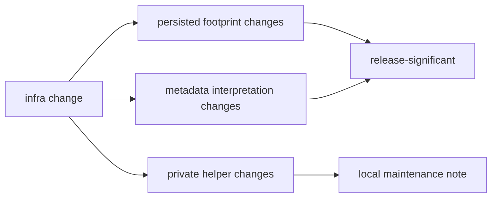

# Release and Versioning

Versioning pressure in infra comes from persisted repository behavior more than
from algorithmic novelty.

Treat every persisted shape as a promise to future readers. A manifest, sidecar,
history entry, or artifact-inspection report may be read long after the command
that wrote it has changed.

## Versioning Rules

- prefer additive evolution when possible
- treat manifest, report, and history semantics as release-significant
- document any repository-footprint shift explicitly
- avoid calling a footprint or dataset-interpretation change "internal cleanup"
- preserve enough old-field meaning that existing artifacts remain explainable
- name the reader impact when validation adapters or inspection summaries
  change

## Release Decision Table

| change | release treatment |
| --- | --- |
| new manifest or history field | describe the field, writer, and reader |
| changed dataset sidecar meaning | describe compatibility and migration expectations |
| changed override expansion | document how reproduced runs differ |
| changed artifact inspection output | document reviewer-visible report changes |
| private helper refactor | omit unless persisted behavior changes |

## Release Smell

If a release note would hide a changed run footprint behind generic wording,
the repository contract is being described dishonestly.

## Proof Path

Inspect the [run layout guide](../../../crates/bijux-gnss-infra/docs/RUN_LAYOUT.md),
[dataset guide](../../../crates/bijux-gnss-infra/docs/DATASETS.md), and
[validation guide](../../../crates/bijux-gnss-infra/docs/VALIDATION.md). Then
inspect the matching tests or source family to confirm any claimed release
safety still matches persisted repository behavior.
