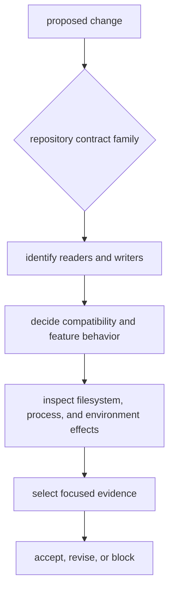

# Infrastructure Review Scope

Infrastructure changes alter how repository state is interpreted, named,
persisted, and inspected. Review the observable contract and every reader or
writer it connects, not only the changed function.

## Review Flow



Start by writing the externally visible change in one sentence. If the sentence
is about signal mathematics, receiver state, navigation estimation, or command
wording, the change probably belongs in another package.

## Risk By Contract Family

| changed family | review risk | inspect first | minimum evidence |
| --- | --- | --- | --- |
| dataset registry and raw-IQ sidecars | a capture can be interpreted with the wrong location, format, rate, frequency, timestamp, or provenance | [dataset contract](../../../crates/bijux-gnss-infra/docs/DATASETS.md) | accepted and rejected metadata, precedence behavior, and path normalization relative to the registry |
| run identity and directory layout | the same declared run can resolve to a different footprint or collide with another run | [run-layout contract](../../../crates/bijux-gnss-infra/docs/RUN_LAYOUT.md) | deterministic identity, isolated directory creation, and compatibility decision |
| manifests, reports, and history | persisted evidence can become unreadable, incomplete, or detached from its provenance | [run-footprint contracts](../interfaces/run-footprint-contracts.md) | serialized field review, reader impact, history append behavior, and schema/version decision |
| artifact explanation and validation | a malformed or unsupported artifact can be presented as valid, or a valid artifact can be rejected | [validation boundary](../../../crates/bijux-gnss-infra/docs/VALIDATION.md) | successful artifact, malformed artifact, schema behavior, and diagnostic preservation |
| overrides and sweeps | a textual parameter can mutate the wrong receiver field or vary nondeterministically | [override contract](../../../crates/bijux-gnss-infra/docs/OVERRIDES.md) | accepted value, unsupported key, invalid value, and deterministic expansion |
| hashes and provenance | runs that differ can appear equal, or matching runs can appear unrelated | [hashing contract](../../../crates/bijux-gnss-infra/docs/HASHING.md) | declared hash inputs, stable ordering, dirty-state meaning, and changed-field rationale |
| reference adapters and re-exports | infrastructure can redefine product semantics or expose an unavailable feature surface | [public API contract](../../../crates/bijux-gnss-infra/docs/PUBLIC_API.md) | owning-package proof, default-feature build, and feature-disabled build |

Diff size is not a useful proxy for risk. Renaming one serialized field or
changing one path join can be more consequential than adding an isolated helper.

## Side Effects Requiring Explicit Review

```mermaid
flowchart LR
    call["infrastructure call"]
    files["directories and JSON records"]
    history["shared run history"]
    cache["process-wide run-context cache"]
    process["Git, toolchain, and CPU probes"]
    env["process environment"]

    call --> files
    call --> history
    call --> cache
    call --> process
    call --> env
```

- Creating a run layout writes directories.
- Writing a manifest also appends a shared run-history record relative to the
  process working directory, not the explicit run output.
- Writing a run report sets `BIJUX_RUN_ID` for the current process.
- Run-context resolution caches the first context process-wide when neither an
  output nor resume location is explicit.
- Provenance collection can invoke repository and toolchain commands and read
  CPU features.
- Dataset resolution turns registry-relative locations into resolved paths.
- Feature selection changes which navigation validation and re-export surfaces
  exist.

A review must consider failure after a partial effect. Ask what remains if a
manifest write succeeds but history append fails, whether repeated calls are
safe, and whether cached context, working-directory state, or environment state
makes parallel calls interfere.

## Compatibility Questions

For every persisted or public change, answer:

1. Can existing manifests, reports, datasets, and artifacts still be read?
2. If meaning changed, is a schema or model version required?
3. Do deterministic and ordinary execution still produce explainable
   identities?
4. Do default, feature-disabled, and relevant feature-enabled builds expose
   intentional APIs?
5. Does an error identify the repository object and violated contract without
   leaking ambiguous low-level context?
6. Are command, receiver, and validation consumers updated together where the
   contract crosses package boundaries?

Compatibility is not preserved merely because deserialization succeeds. A field
whose unit, provenance, precedence, or interpretation changes is a contract
change.

## Evidence Strength

The package currently has dedicated integration targets for typed overrides and
repository guardrails. Dataset resolution, raw-IQ metadata, artifact inspection,
coordinate parsing, hashing, and selected provenance behavior are covered by
module tests. Run-layout persistence and validation adapters do not have equally
broad dedicated integration coverage.

That asymmetry should shape review:

- Do not cite the guardrail test as proof of dataset or persistence behavior.
- Add focused temporary-directory evidence when changing filesystem semantics.
- Pair adapter changes with tests from the product package that owns the
  scientific result.
- State a remaining integration gap explicitly when the change cannot close it.

The [infrastructure test guide](../../../crates/bijux-gnss-infra/docs/TESTS.md)
and [test strategy](../quality/test-strategy.md) describe the available proof
families.

## Blocking Conditions

Block the change when:

- a caller builds run paths or interprets sidecars independently of
  infrastructure;
- a persisted field changes without a reader and compatibility decision;
- a test writes into the developer's real repository evidence;
- a parallel test relies on process-global run context, working directory, or
  environment without isolation;
- an override accepts an unknown key or silently coerces an invalid value;
- artifact inspection repairs or normalizes evidence without reporting it;
- provenance omits an input that materially changes interpretation;
- an infrastructure API imports scientific ownership from receiver or
  navigation merely for caller convenience;
- feature-disabled behavior is unknown for a changed gated surface.

Review is complete when the repository behavior, side effects, compatibility
decision, and evidence can be understood without reading implementation paths.
