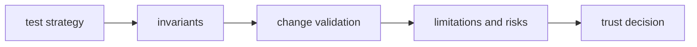

# Quality

Open this section when the question is whether `bijux-gnss-infra` is proving
its repository-facing claims strongly enough: invariants, verification,
limitations, risks, and trust boundaries.

## Trust Model

## Read These First

- open [Test Strategy](test-strategy.md) first when you need the broad proof
  shape
- open [Invariants](invariants.md) when the question is what callers may safely
  assume about repository behavior
- open [Change Validation](change-validation.md) when you need the minimum
  proof for a safe infra change

## First Proof Check

- `crates/bijux-gnss-infra/docs/TESTS.md`
- `crates/bijux-gnss-infra/tests/`
- crate-local docs for datasets, run layout, overrides, and validation

## Pages In This Section

- [Test Strategy](test-strategy.md)
- [Invariants](invariants.md)
- [Change Validation](change-validation.md)
- [Review Checklist](review-checklist.md)
- [Definition of Done](definition-of-done.md)
- [Known Limitations](known-limitations.md)
- [Risk Register](risk-register.md)

## Leave This Section When

- leave for [Foundation](../foundation/) when the doubt is still about what
  belongs in the crate
- leave for [Interfaces](../interfaces/) when the real question is what public
  repository promise exists, not how well it is defended
