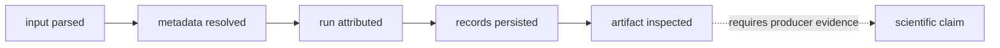
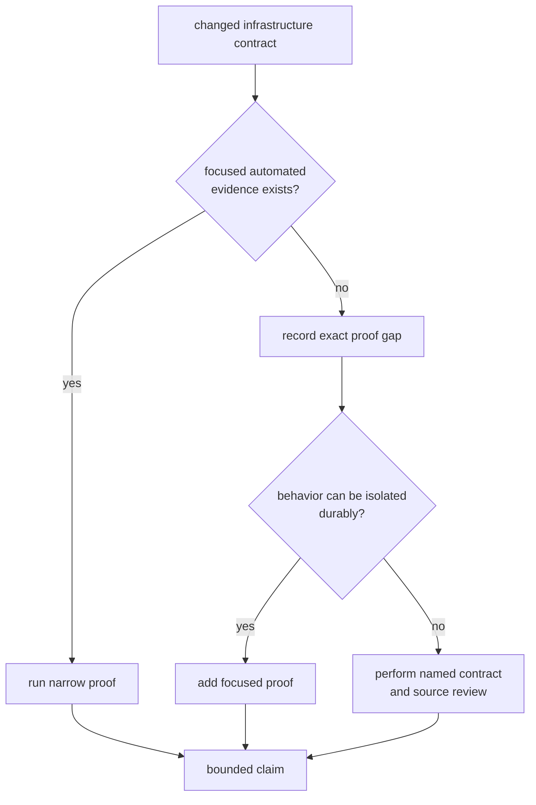

# Infrastructure Evidence Guide

Infrastructure quality means repository evidence remains identifiable,
interpretable, and reviewable after the producing process exits. It does not
mean the persisted scientific result is correct.

## Separate The Claims

| successful operation | supported claim | unsupported leap |
| --- | --- | --- |
| Registry load | entries parsed and relative locations normalized | capture bytes exist or contain usable signals |
| Raw-IQ resolution | supplied metadata is present, valid, and mutually consistent | sample contents match the declaration |
| Manifest or report write | current repository context was serialized | execution completed or is bit-for-bit reproducible |
| Artifact validation without diagnostics | current-schema rows passed selected checks | mission quality or algorithm accuracy |
| Reference alignment | epochs were paired under the selected policy | position error is acceptable |
| Provenance hashing | implemented identity inputs can be compared | all hardware, tools, remote data, and environment are reproduced |

## Select Evidence By Contract

Use [test strategy](test-strategy.md) for current automated coverage,
[invariants](invariants.md) for caller assumptions, and
[change validation](change-validation.md) to match a change to proof.

## Current Coverage Is Uneven

Dataset registry and raw-IQ metadata have focused module evidence. Artifact
inspection covers representative acquisition input, tracking-order diagnostics,
and navigation explanation. Overrides have focused tests and one integration
route. Package guardrails prove repository policy shape.

Run-layout persistence, history append behavior, reference-alignment
composition, Git-state capture, CPU-feature capture, and the full override
catalog do not have equivalent integration breadth. Do not present source
inspection as automated proof; name the reviewed behavior and residual risk.

## Reader Policy Matters

Non-strict validation can accept a known empty artifact with no diagnostics.
Use strict behavior when evidence-producing workflows require at least one row.

Artifact readers currently accept only the current shared schema. Rejection of
an older row means unsupported by this reader, not necessarily corrupt. A
compatibility claim therefore needs explicit older-record evidence rather than
a current writer-reader round trip.

## Failure Signals

- A test asserts a path assembled outside the run-layout contract.
- A manifest snapshot changes without explaining reader impact.
- A hash changes without a statement of governed identity inputs.
- An empty artifact is cited as successful evidence.
- An artifact validator is described as proving receiver or navigation quality.
- Generated test runs append to repository-owned history.
- A guardrail pass is reported as dataset, persistence, or artifact proof.

Use [known limitations](known-limitations.md), the
[risk register](risk-register.md), [review checklist](review-checklist.md), and
[definition of done](definition-of-done.md) to keep claims bounded.

## Evidence Sources

The [package test guide](../../../crates/bijux-gnss-infra/docs/TESTS.md) maps
current evidence. Representative proof includes
[override integration](../../../crates/bijux-gnss-infra/tests/integration_overrides.rs),
[artifact inspection tests](../../../crates/bijux-gnss-infra/src/artifact_inspection/tests.rs),
and [package guardrails](../../../crates/bijux-gnss-infra/tests/integration_guardrails.rs).
