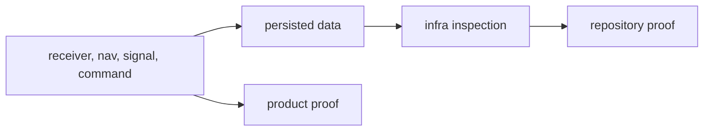

# Known Limitations

`bijux-gnss-infra` is strong on repository contract clarity, but some proof
areas are still lighter than the surface breadth it owns.

## Limits Readers Should Know

| limitation | consequence | honest reading |
| --- | --- | --- |
| Automated tests are narrower than the contract surface. | Override and guardrail tests are strong, but dataset, run layout, validation adapter, and hashing claims may require source and fixture inspection. | Name manual/source proof when no dedicated integration test exists. |
| Repository proof is not product proof. | Infra can prove how artifacts are found, named, inspected, and validated, not that the underlying receiver or navigation result is scientifically correct. | Pair infra proof with producer proof for product claims. |
| Re-exports are convenience, not ownership. | `api.rs` may expose lower records so callers can inspect repository state without extra imports. | Follow meaning back to core, receiver, nav, or signal when the record was produced there. |
| Persisted footprints age. | Manifests, reports, and histories must remain readable after commands change. | Treat layout drift as a compatibility issue, not a formatting cleanup. |
| Dataset provenance is bounded by registered metadata. | A resolved dataset path does not prove the raw capture is scientifically sufficient. | Use dataset proof for identity and provenance, not signal-quality claims. |

## Proof Boundary

Repository proof and product proof are both needed for strong public claims.
Infra alone can only defend the repository side.

## First Proof Route

- `crates/bijux-gnss-infra/docs/TESTS.md`
- `crates/bijux-gnss-infra/tests/integration_guardrails.rs`
- `crates/bijux-gnss-infra/tests/integration_overrides.rs`
- `crates/bijux-gnss-infra/docs/RUN_LAYOUT.md`
- `crates/bijux-gnss-infra/docs/DATASETS.md`
- `crates/bijux-gnss-infra/docs/VALIDATION.md`

If the sentence claims scientific correctness, narrow it or add proof from the
producer crate. If the sentence claims repository durability, keep the proof in
infra and name the exact persisted contract.
