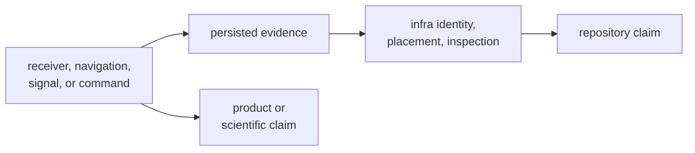

# Known Limitations

Infra can make persisted evidence identifiable and reviewable without making
that evidence scientifically sufficient. Readers should use the limits below
when interpreting a successful load, write, explanation, or validation.

## What Success Does Not Prove

| successful operation | what it proves | what remains unproved |
| --- | --- | --- |
| dataset registry load | the registry parsed and relative locations were normalized | referenced capture bytes exist, are complete, or have sufficient signal quality |
| raw-IQ metadata resolution | declared metadata is present, internally valid, and consistent across supplied sources | sample contents match the declaration or contain usable GNSS signals |
| run report or manifest write | repository context was serialized at the current schema | the run completed, can be reproduced bit-for-bit, or produced valid science |
| artifact validation with no diagnostics | every non-empty row parsed at the current schema and emitted no selected diagnostics | acquisition, tracking, observation, or navigation quality meets a mission threshold |
| reference alignment | at least one solution epoch aligned under the selected policy | position error or estimator behavior is acceptable |
| provenance hash capture | the recorded inputs can be compared by the implemented hash policy | the working tree, external tools, hardware, or remote data are fully reproducible |

## Current Proof Gaps

Automated proof is uneven by family:

- Dataset registry and raw-IQ metadata behavior have focused module tests.
- Artifact inspection directly covers accepted acquisition data, non-monotonic
  tracking indices, and navigation explanation.
- Overrides have one integration case plus focused module tests.
- Repository guardrails have a dedicated integration test.
- Run-layout persistence, history behavior, reference validation composition,
  and several provenance paths do not have equivalent integration breadth.

For the lighter families, do not present documentation or source inspection as
automated proof. Name the exact behavior reviewed and keep the claim narrower
than the available evidence.

## Empty And Older Artifacts

Non-strict artifact validation can accept a known empty artifact with no
diagnostics. Use strict mode whenever an evidence-producing workflow requires at
least one row.

Artifact readers accept only the current shared schema version. They do not
migrate older rows. A schema rejection therefore means "unsupported by this
reader," not necessarily "corrupt data."

## Ownership Boundary

Use the [infra test guide](../../../crates/bijux-gnss-infra/docs/TESTS.md) to
locate available proof, the
[run layout guide](../../../crates/bijux-gnss-infra/docs/RUN_LAYOUT.md) for
persisted-footprint commitments, and
[Artifact Inspection Contracts](../interfaces/artifact-inspection-contracts.md)
for validator semantics. Product or scientific claims require evidence from the
package that produced the underlying result.
