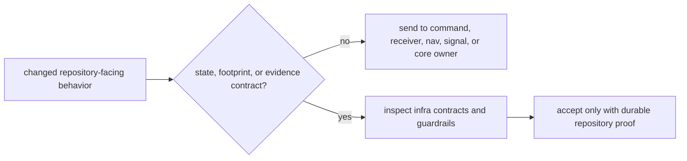

# Review Checklist

Review `bijux-gnss-infra` as repository-state infrastructure. It may own
dataset identity, run footprints, persisted evidence contracts, artifact
inspection, override expansion, and provenance. It should not become the place
where command policy, receiver runtime behavior, or product-science meaning is
repackaged as "infrastructure."

## Review Gates

| changed surface | accept only when | inspect before accepting |
| --- | --- | --- |
| dataset or sidecar interpretation | The same on-disk dataset state resolves identically across callers. | [Dataset contracts](../interfaces/dataset-contracts.md) and [infra contract guide](../../../crates/bijux-gnss-infra/docs/CONTRACTS.md) |
| run footprint or persisted artifact | The artifact remains understandable after the producing process is gone. | [Run Footprint Contracts](../interfaces/run-footprint-contracts.md), [Persisted Artifact Contracts](../interfaces/persisted-artifact-contracts.md) |
| override or sweep behavior | Expansion is typed, reviewable, and reproducible; it is not hidden command policy. | [Override and sweep contracts](../interfaces/override-and-sweep-contracts.md) and override integration proof |
| provenance or hashing | The hash explains repository reproducibility instead of becoming a general cryptographic helper. | [Provenance and hashing](../interfaces/provenance-and-hashing.md) and [infra boundary guide](../../../crates/bijux-gnss-infra/docs/BOUNDARY.md) |
| public import or adapter | The export is an infrastructure contract, not a shortcut to another crate's owner. | [API surface](../interfaces/api-surface.md), curated API source, and guardrail proof |

## Blocking Signs

- A command workflow rule is stored here because it was easier than extending
  the command crate.
- A receiver artifact gains persistence semantics before infra describes the
  reader contract.
- A dataset field is accepted by one caller but has no repository-wide
  interpretation.
- A new helper has no durable relationship to datasets, run identity,
  persisted artifacts, overrides, provenance, or inspection.

## Evidence To Require

- Read the [infra contract guide](../../../crates/bijux-gnss-infra/docs/CONTRACTS.md)
  and [infra test guide](../../../crates/bijux-gnss-infra/docs/TESTS.md) before
  accepting changed behavior.
- Require infra guardrail coverage or a narrower contract test for
  boundary-sensitive changes.
- Update the matching interface page whenever an on-disk repository contract
  changes.
- Send product meaning back to `bijux-gnss-core`, runtime behavior back to
  `bijux-gnss-receiver`, and operator policy back to `bijux-gnss`.
