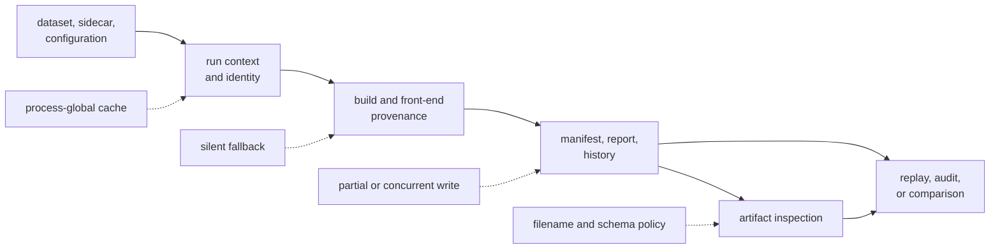
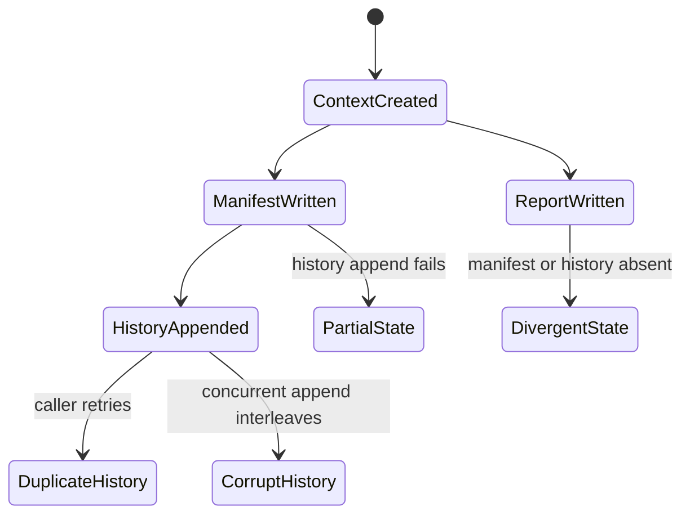

# Infrastructure Evidence Risk Register

Infrastructure turns datasets, configuration, build context, and product
artifacts into persisted evidence. Its main trust risk is not a numerical
solver error; it is recording or interpreting the wrong context while
producing plausible files.

Every risk below is active in the current implementation. “Current control”
means code or proof that exists now. “Required treatment” is not a claim that
the risk has been resolved.

## Where Evidence Can Drift

Use the register when changing any edge in this graph. A schema field, path
normalization rule, default, or write order can alter scientific
reproducibility even when product calculations are unchanged.

## Run Context and Identity

| Risk | Trigger and consequence | Current control | Residual gap | Required treatment |
| --- | --- | --- | --- | --- |
| process-global context reuse | Two run-directory requests occur in one process without explicit output or resume paths. The first resolved context is returned for later commands, datasets, configurations, or deterministic settings. Evidence can land in the wrong run directory. | Explicit output and resume paths bypass the cache. | Cache lookup occurs before validating the later dataset requirement, and there is no multi-context proof. | Key the cache by every identity input or remove global reuse; add same-process tests with differing command, dataset, config, and determinism. |
| under-specified run identity | Configuration hash, serialized dataset hash, and package version match while command, Git state, features, toolchain, CPU, or build metadata differ. Distinct executions receive the same `run_id`. | Manifest and report record several omitted dimensions; default directory names add command and timestamp. | Deterministic directories and exported run identity can still conflate materially different executions. | Publish the identity contract, include every dimension required for equality, and add collision/inequality tests. |
| checkout-dependent dataset identity | Registry-relative paths are normalized to absolute strings before the dataset entry is serialized and hashed. The same registered data in another checkout can receive a different dataset hash and run identity. | Registry loading consistently resolves paths relative to the registry location. | Location stability is confused with dataset-content identity; file content is not hashed here. | Hash canonical dataset semantics and content identity separately from local resolved paths. |

Evidence:

- [run-context resolution](../../../crates/bijux-gnss-infra/src/run_layout/directories/context.rs)
- [run fingerprint construction](../../../crates/bijux-gnss-infra/src/run_layout/identity/fingerprint.rs)
- [registry path normalization](../../../crates/bijux-gnss-infra/src/datasets/registry/loading.rs)

## Dataset and Provenance Interpretation

| Risk | Trigger and consequence | Current control | Residual gap | Required treatment |
| --- | --- | --- | --- | --- |
| unenforced registry version | A registry declares any numeric version. Deserialization retains the value, but loading does not accept or reject versions explicitly. A future or mistaken schema can be interpreted with current semantics. | Required fields must deserialize and the entry list must be non-empty. | The version field creates an appearance of compatibility policy without enforcing one. | Define supported versions, reject unknown versions, and test migration or refusal. |
| implicit metadata failure fallback | Registry metadata or a registry-referenced sidecar fails resolution while no sidecar was supplied explicitly. Front-end provenance suppresses the error and falls back to receiver-profile values. A report can omit failed capture metadata without marking degradation. | An explicitly supplied invalid sidecar is retried and returned as an error; valid registry and sidecar metadata are cross-checked. | Implicit metadata failures are indistinguishable from intentionally absent metadata in the persisted result. | Preserve resolution status and error reason; require explicit policy for fallback versus refusal. |
| uncertain Git state recorded as clean | The Git status process cannot start or exits unsuccessfully. The dirty helper returns `false`, while the hash may become `unknown`. Evidence can present an unknown workspace as clean. | Git hash records `unknown` when resolution fails. | Dirty state has only a boolean representation, so unknown collapses into clean. | Use a clean/dirty/unknown state and persist command failure context. |

Evidence:

- [dataset registry contract](../../../crates/bijux-gnss-infra/src/datasets/registry.rs)
- [front-end provenance resolution](../../../crates/bijux-gnss-infra/src/run_layout/provenance/front_end.rs)
- [Git provenance collection](../../../crates/bijux-gnss-infra/src/hash/provenance.rs)

## Persistence and Compatibility

Manifest, report, and history are separate operations rather than one
transaction. A successful individual write does not imply a coherent run
footprint.

| Risk | Trigger and consequence | Current control | Residual gap | Required treatment |
| --- | --- | --- | --- | --- |
| non-atomic record replacement | A process stops or a filesystem write fails while replacing a manifest or report. Readers may observe truncation or a partially updated footprint. | Serialization completes before the direct write starts, and write errors are returned. | No temporary-file, flush, rename, or recovery protocol exists. | Use atomic replacement appropriate to the filesystem and test interrupted/failing writes. |
| split manifest and history commit | Manifest writing succeeds and history append fails, or a caller retries after an ambiguous failure. The run can exist without history or gain duplicate history rows. | The function reports append failure to its caller. | There is no idempotency key, reconciliation, or transaction marker. | Define commit order and recovery; make history append idempotent or rebuildable from manifests. |
| concurrent history corruption | Multiple processes append to the shared JSON-lines history simultaneously. Rows can race or interleave depending on filesystem behavior. | Append mode reduces accidental overwrite by one writer. | No lock, single-writer service, atomic-row guarantee, or concurrency test exists. | Add an explicit concurrency strategy and stress proof. |
| write-only run schemas | Manifest, report, and history structs serialize current records, but infrastructure exposes no corresponding readers or migrations. Old records cannot be validated or upgraded through this package. | Layout and report version numbers are persisted. | Version numbers alone do not provide compatibility; reader behavior is undefined. | Add version-aware readers, fixture history, refusal policy, and migrations before changing durable schemas. |

Evidence:

- [manifest persistence](../../../crates/bijux-gnss-infra/src/run_layout/records/manifest.rs)
- [report persistence](../../../crates/bijux-gnss-infra/src/run_layout/records/report.rs)
- [history append](../../../crates/bijux-gnss-infra/src/run_layout/records/history.rs)
- [run layout contract](../../../crates/bijux-gnss-infra/docs/RUN_LAYOUT.md)

## Artifact Inspection

| Risk | Trigger and consequence | Current control | Residual gap | Required treatment |
| --- | --- | --- | --- | --- |
| filename-derived artifact type | Explanation always infers kind from filename substrings; validation also infers when no explicit kind is supplied. A misleading name can choose the wrong deserializer or make a valid artifact unsupported. | Validation accepts an explicit recognized kind; payload deserialization usually fails for a wrong type. | Explanation has no explicit-kind override, and filename meaning is not checked against header or payload identity. | Carry artifact kind in a trusted envelope and verify explicit, inferred, and payload identities agree. |
| latest-only artifact reader | A persisted artifact uses any schema version other than the current latest value. Inspection rejects it even if an older version was once valid. | Refusal is explicit rather than silently coercing fields. | Historical evidence becomes unreadable after a version increment unless migrated elsewhere. | Define a read-policy matrix, retain versioned fixtures, and provide migration or documented end-of-support behavior. |
| misleading strict mode | Validation runs with strict mode enabled. Strictness currently adds only an early empty-file error; it does not escalate warning or error diagnostics into a failing result. A caller can assume stronger enforcement than occurs. | Diagnostics are returned with typed severities, and malformed payloads fail parsing. | The boolean name communicates a policy that the implementation does not enforce. | Define strict acceptance criteria or replace the flag with an explicit empty-input policy and caller-owned diagnostic threshold. |
| diagnostic success ambiguity | Payload validation returns error-severity diagnostic events inside a successful `Result`. A caller checks only process/API success and misses scientific or structural findings. | Explanation counts error and warning diagnostics for display. | The validation API has no accepted/refused decision distinct from transport/parsing success. | Add an explicit validation outcome and require callers to choose severity policy. |

Evidence:

- [artifact kind detection](../../../crates/bijux-gnss-infra/src/artifact_inspection/artifact_type.rs)
- [artifact validation](../../../crates/bijux-gnss-infra/src/artifact_inspection/validation.rs)
- [artifact explanation](../../../crates/bijux-gnss-infra/src/artifact_inspection/summary.rs)
- [schema read policy](../../../crates/bijux-gnss-infra/src/artifact_inspection/validation/schema_policy.rs)

## Ownership and Glue Growth

Infrastructure legitimately touches dataset paths, run records, and persisted
artifacts. That adjacency can attract unrelated helpers.

Reject a change when it:

- decides receiver stage acceptance rather than preserving receiver evidence
- defines navigation or signal science while formatting a report
- moves operator command grammar into infrastructure
- adds a generic filesystem or process helper without an infrastructure
  contract
- creates another persisted record without a reader, version policy, and
  lifecycle owner
- duplicates artifact schema meaning owned by core

Use the [infrastructure ownership model](../foundation/ownership-boundary.md)
and [infrastructure domain language](../foundation/domain-language.md) before
admitting a new responsibility.

## Review and Detection

For a changed risk, require evidence that can trigger the failure:

| Risk family | Detection evidence |
| --- | --- |
| context and identity | same-process multi-run tests, equality/inequality matrix, cross-checkout identity fixture |
| metadata provenance | explicit and registry-derived valid, absent, malformed, and conflicting metadata |
| Git provenance | clean, dirty, non-repository, missing executable, and failed process |
| persistence | permission failure, interruption, retry, duplicate recovery, and concurrent writers |
| schema compatibility | every supported historical fixture plus unknown-version refusal |
| artifact typing | misleading names, explicit-kind disagreement, header disagreement, and extension changes |
| strict validation | empty input and every diagnostic severity with asserted acceptance outcome |

The [infrastructure validation guide](../../../crates/bijux-gnss-infra/docs/VALIDATION.md)
maps persisted evidence back to product owners. The
[infrastructure proof inventory](../../../crates/bijux-gnss-infra/docs/TESTS.md)
shows existing tests; absence from that inventory is not evidence that a risk
is controlled.

Close a risk only when the treatment is implemented, focused failure evidence
passes, compatibility impact is documented, and the residual exposure is
explicit. Documentation alone does not close any item in this register.
