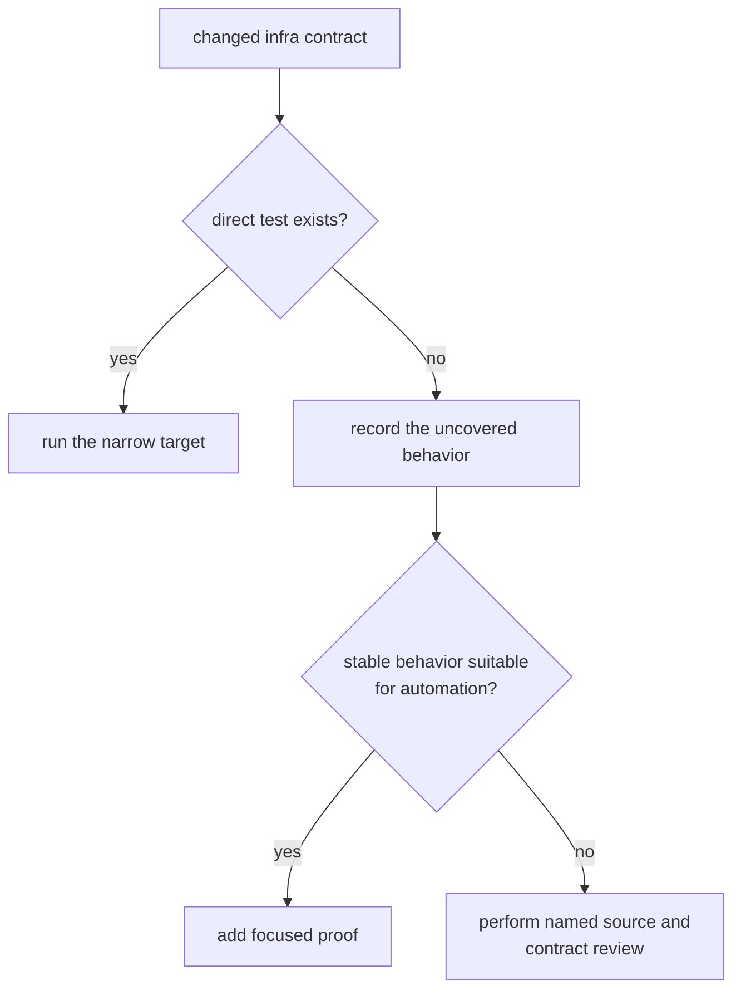

# Test Strategy

Infra tests should prove repository behavior that another workflow relies on:
how inputs are interpreted, where outputs are placed, what persisted records
mean, and how existing evidence is inspected. Receiver performance, signal
generation, and navigation accuracy remain proof obligations of their owning
packages.

## Current Automated Evidence

| family | direct evidence today | safe claim |
| --- | --- | --- |
| dataset registry | relative-location normalization and recorded-capture provenance | registered entries preserve identity and resolve relative locations against the registry |
| raw-IQ metadata | source precedence, cross-source agreement, required fields, and format/quantization constraints | invalid or contradictory metadata is refused before ingest |
| artifact inspection | accepted acquisition rows, non-monotonic tracking indices, and navigation explanations | current-schema JSONL is dispatched by kind and selected sequence faults become diagnostics |
| override behavior | deterministic seed policy, unsupported sweep keys, and one weighting-mode integration case | supported overrides mutate typed receiver configuration and unsupported keys fail explicitly |
| coordinate parsing | accepted triples and incomplete input | repository coordinates require complete triples |
| provenance | configuration hashing without an explicit file | a serialized profile can supply configuration identity |
| front-end provenance | sidecars missing sample rate or intermediate frequency | incomplete front-end context is refused before persistence |
| package boundary | one guardrail integration test | repository shape satisfies the configured package policy |

This is useful coverage, but it is not broad end-to-end proof. In particular,
run-layout persistence, history appends, reference-alignment composition, Git
state capture, CPU feature capture, and the full override catalog do not have
equivalent integration coverage.

## Select Evidence By Change

| changed behavior | narrowest useful command | further evidence |
| --- | --- | --- |
| override integration | `cargo test -p bijux-gnss-infra --test integration_overrides` | focused module tests for the changed key or policy |
| package boundary | `cargo test -p bijux-gnss-infra --test integration_guardrails` | dependency and public-surface review |
| dataset, artifact, parsing, or provenance module | `cargo test -p bijux-gnss-infra --lib` | the specific unit test names that defend the claim |
| several infra families | `cargo test -p bijux-gnss-infra` | contract review for every persisted or public surface changed |
| run layout or reference adapter only | no dedicated integration target today | named source review, contract review, and new focused proof when behavior can be isolated |

Passing the guardrail test does not validate datasets or artifacts. Passing the
override integration test does not validate every accepted sweep key. Report
the command and the behavior it protects instead of using "infra tests passed"
as a blanket claim.

## Where To Add Proof

- Put pure parsing, normalization, dispatch, and refusal cases beside the owning
  module when no filesystem workflow is needed.
- Use an integration target when the contract crosses public API, persistence,
  or package boundaries.
- Assert durable records and diagnostics, not incidental display strings.
- Include malformed, missing, contradictory, and older-schema inputs where the
  contract defines refusal.
- Keep generated test evidence isolated from repository-owned run history.

The [infra test guide](../../../crates/bijux-gnss-infra/docs/TESTS.md) is the
short command map. Use [Known Limitations](known-limitations.md) before making a
coverage claim and [Change Validation](change-validation.md) to match evidence
to a proposed change.
