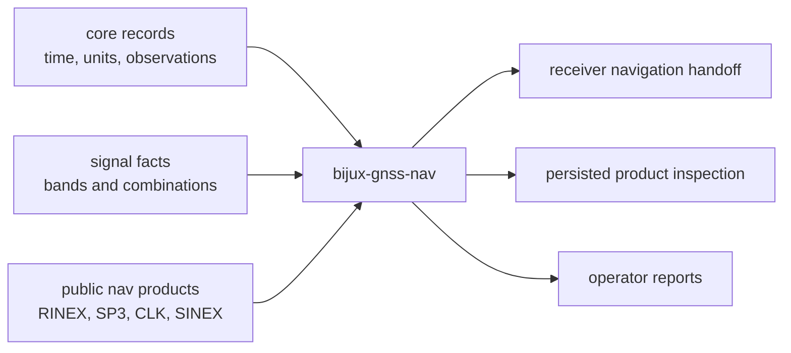

# Architecture Risks

`bijux-gnss-nav` owns navigation-domain science: message and product parsing,
orbit and clock state, corrections, time models, SPP, PPP, RTK, integrity, and
supporting physical models. Its architecture risk is overreach in both
directions: runtime orchestration can leak inward, and solver-local detail can
leak outward as public science.

## Risk Map

Navigation owns the scientific middle of this graph. It should not own receiver
scheduling, repository layout, or command presentation.

## Highest-Risk Changes

- the crate is broad enough that convenience exports can slowly erase internal
  boundaries
- runtime-neutral helpers can be mistaken for permission to own runtime
  orchestration
- solver-local policy can leak into the public API because downstream crates
  genuinely consume many surfaces
- precise-product parsing and validation pressures can tempt repository logic
  inward
- local matrix and model helpers can drift toward unreviewed generic utility
  ownership if not kept tied to navigation use

## Review Triage

| change shape | risk to inspect | better destination when it is not nav-owned |
| --- | --- | --- |
| new parser or product reader | repository dataset or run-layout policy slips into domain parsing | `bijux-gnss-infra` for repository state |
| new correction or model helper | model is too local to one solver but becomes public | keep private in the owning nav subsystem |
| new estimator field | solver state leaks into shared records without a contract | `bijux-gnss-core` for shared result meaning |
| new receiver-facing helper | runtime scheduling or stage policy is hidden in nav | `bijux-gnss-receiver` |
| new command-facing summary | presentation policy becomes scientific API | `bijux-gnss` |

## Proof To Request

- `crates/bijux-gnss-nav/docs/FORMATS.md` for message, RINEX, and product
  parsing changes.
- `crates/bijux-gnss-nav/docs/ORBITS.md`, `TIME.md`, `MODELS.md`, and
  `CORRECTIONS.md` for physical model changes.
- `crates/bijux-gnss-nav/docs/ESTIMATION.md` for SPP, PPP, RTK, integrity, or
  solution claim changes.
- `crates/bijux-gnss-nav/docs/PUBLIC_API.md` before exposing solver-local
  helpers.
- `crates/bijux-gnss-nav/docs/TESTS.md` to select proof by scientific claim.

Reject a navigation architecture change that cannot name the scientific family
it strengthens. "A downstream crate needs it" is not enough.
