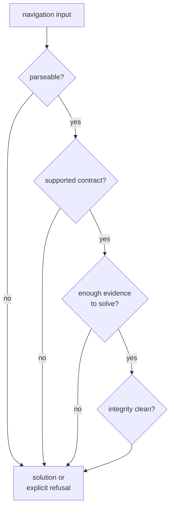

# Error Model

Navigation code has more than one honest failure mode. The architecture should
keep them distinct.

## Error Route

## Failure Families

| family | meaning | evidence standard |
| --- | --- | --- |
| parse rejection | external message or precise product cannot be interpreted | include product family and rejected field context |
| unsupported contract | input is well-formed but outside supported signal, product, constellation, or mode | report unsupported boundary explicitly |
| solver refusal | geometry, products, corrections, or observations do not justify a solution claim | emit refusal class and prerequisite evidence |
| integrity suspicion | data can be processed but should not be treated as clean | preserve RAIM, residual, anomaly, or downgrade evidence |
| product-policy downgrade | precise products are incomplete, stale, or below requested support | report action and product support state |
| estimator degradation | solution exists with degraded covariance, weighting, or lifecycle state | expose quality and lifecycle evidence |

## Review Rules

- Do not collapse parser rejection into solver refusal.
- Do not treat downgraded precise products as malformed input.
- Do not claim a solution when prerequisites are missing.
- Preserve integrity evidence even when the final caller chooses to continue.
- Keep command rendering and persisted run layout outside nav.

## First Proof Check

Inspect `crates/bijux-gnss-nav/src/formats/`,
`crates/bijux-gnss-nav/src/estimation/position/solver/solution_outcome.rs`,
`crates/bijux-gnss-nav/src/estimation/position/integrity/`,
`crates/bijux-gnss-nav/src/estimation/solution_claims.rs`, and
`crates/bijux-gnss-nav/docs/ESTIMATION.md`.
