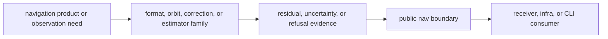

# Extensibility Model

Extending `bijux-gnss-nav` should mean adding a new scientific family or
deepening an existing one, not bolting new convenience glue onto the public
surface.

## Scientific Extension Flow

## Legitimate Extension Paths

- add a new constellation-specific format or orbit family under `formats/` or
  `orbits/`
- add a new correction family with clear GNSS-domain semantics
- extend `position`, `ppp`, or `rtk` with evidence-backed solver behavior
- add a new typed provider or model seam needed by multiple scientific paths

## Illegitimate Extension Paths

- adding command-specific wrappers directly to `api.rs`
- adding file-discovery logic to a parser family
- exposing internal solver helpers only because one caller needs quick access

## Decision Table

| proposed extension | nav-owned when | route elsewhere when |
| --- | --- | --- |
| parser | it interprets navigation-product meaning | it discovers repository files |
| correction | it models a physical, constellation, signal, or product effect | it formats operator output |
| estimator behavior | it changes solution, residual, integrity, RTK, or PPP evidence | it schedules receiver channels |
| provider seam | multiple scientific paths need the abstraction | one command needs shorter glue |

## Review Checks

- Can the new surface be named by a durable scientific responsibility?
- Are frames, units, timescales, and product provenance visible to readers?
- Does unsafe input produce refusal evidence instead of a quiet solution claim?
