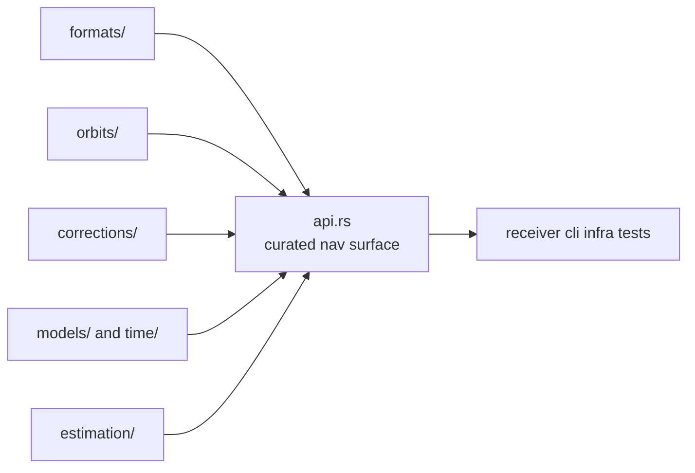

# Architecture

Open this section when the question is structural: where formats, orbits,
corrections, models, and estimation families live in code, and how the crate
stays broad without becoming a shapeless monolith.

## Structural Shape

`bijux-gnss-nav` is not one pipeline. It is a scientific package with explicit
subsystems: product interpretation, orbit and time reasoning, correction law,
and multiple estimation families that share physical assumptions but keep
separate responsibilities.

## Read These First

- open [Foundation](../foundation/) first if the real dispute is still about
  ownership rather than structure
- stay in this section when the question is where a scientific family belongs
  in code and which dependency direction is legitimate

## First Proof Check

- `crates/bijux-gnss-nav/src/lib.rs`
- `crates/bijux-gnss-nav/src/formats.rs`
- `crates/bijux-gnss-nav/src/estimation.rs`
- `crates/bijux-gnss-nav/docs/ARCHITECTURE.md`
