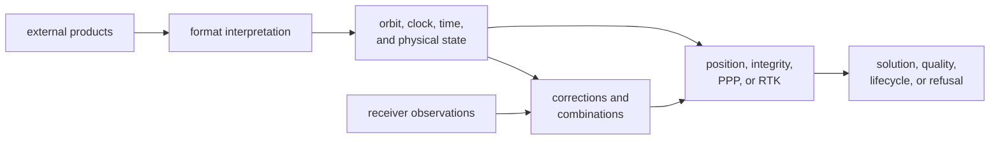
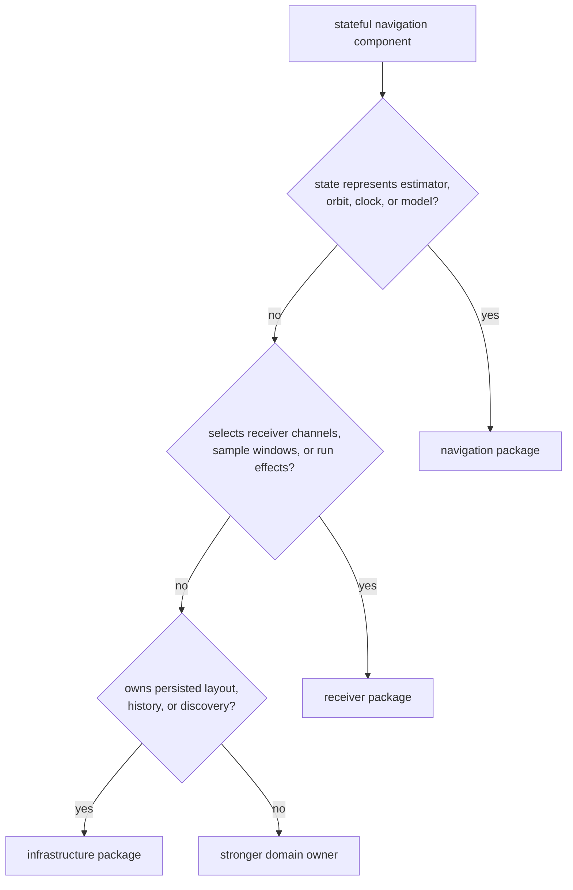

# Navigation Architecture Guide

`bijux-gnss-nav` is organized by scientific dependency, not by one universal
execution pipeline. Format families establish typed products; orbit, clock,
time, and physical models establish state; corrections transform measurements;
position, integrity, PPP, and RTK families produce distinct claims.

## Scientific Dependency Order

Each arrow is a scientific boundary. A parser must not choose estimator policy.
An estimator must not reinterpret product time or silently invent a missing
correction.

## Locate The Scientific Owner

| concern | architecture route | ownership rule |
| --- | --- | --- |
| Broadcast messages, RINEX, precise products, antenna files, or bias records | [Module map](module-map.md) | formats preserve syntax, semantics, provenance, and rejection |
| Satellite state, clock, uncertainty, or navigation-specific time | [Code navigation](code-navigation.md) | orbit and time families resolve product meaning before estimation |
| Atmosphere, bias, combinations, windup, antenna, tide, or celestial effects | [Integration seams](integration-seams.md) | corrections and models expose assumptions rather than hiding them in solvers |
| Standalone position, integrity, filtering, PPP, or RTK | [Execution model](execution-model.md) | each estimator family owns its state and claim lifecycle |
| Dependency on core, signal, receiver, infrastructure, or command | [Dependency direction](dependency-direction.md) | navigation consumes shared contracts but not runtime or persistence policy |
| Stateful filters and persisted result records | [State and persistence](state-and-persistence.md) | nav owns estimator state; infrastructure owns durable placement |
| Parse, product, model, convergence, integrity, or support failure | [Error model](error-model.md) | refusal stays attributable to the failing scientific boundary |
| New format, model, correction, or estimator family | [Extensibility model](extensibility-model.md) | placement follows scientific responsibility, not delivery convenience |

## Statefulness Does Not Mean Runtime Ownership

An EKF, PPP filter, RTK ambiguity state, or product interpolator can remain
navigation-owned because its lifecycle is scientific and runtime-neutral.
Receiver owns when navigation is invoked during a live session.
Infrastructure owns where resulting records are persisted and later found.

## Keep Estimator Families Distinct

Position, integrity, PPP, and RTK share observations, satellite state, and
mathematical support, but they do not share one claim contract. Their
prerequisites, lifecycle, convergence, uncertainty, downgrade, and refusal
evidence differ. Shared helpers belong below those policies; claim-specific
state stays with its estimator family.

## Architecture Failure Signals

- Product parsing requires host wall-clock context to resolve rollover.
- A correction becomes an undocumented term inside a solver.
- A generic result erases whether it came from standalone positioning, PPP, or
  RTK.
- Receiver channel state or repository paths enter navigation modules.
- A missing product becomes a zero correction or nominal state.
- Public exports expose solver-local workspaces with no durable scientific role.

Use [architecture risks](architecture-risks.md) when one of these signals
appears.

## Implementation Evidence

The implementation authorities are the
[format boundary](../../../crates/bijux-gnss-nav/src/formats.rs),
[orbit boundary](../../../crates/bijux-gnss-nav/src/orbits/mod.rs),
[correction boundary](../../../crates/bijux-gnss-nav/src/corrections/mod.rs),
[model boundary](../../../crates/bijux-gnss-nav/src/models/mod.rs),
[estimation boundary](../../../crates/bijux-gnss-nav/src/estimation.rs), and
[navigation time boundary](../../../crates/bijux-gnss-nav/src/time.rs).

The [crate architecture](../../../crates/bijux-gnss-nav/docs/ARCHITECTURE.md)
documents the full package dataflow and dependency rules.
