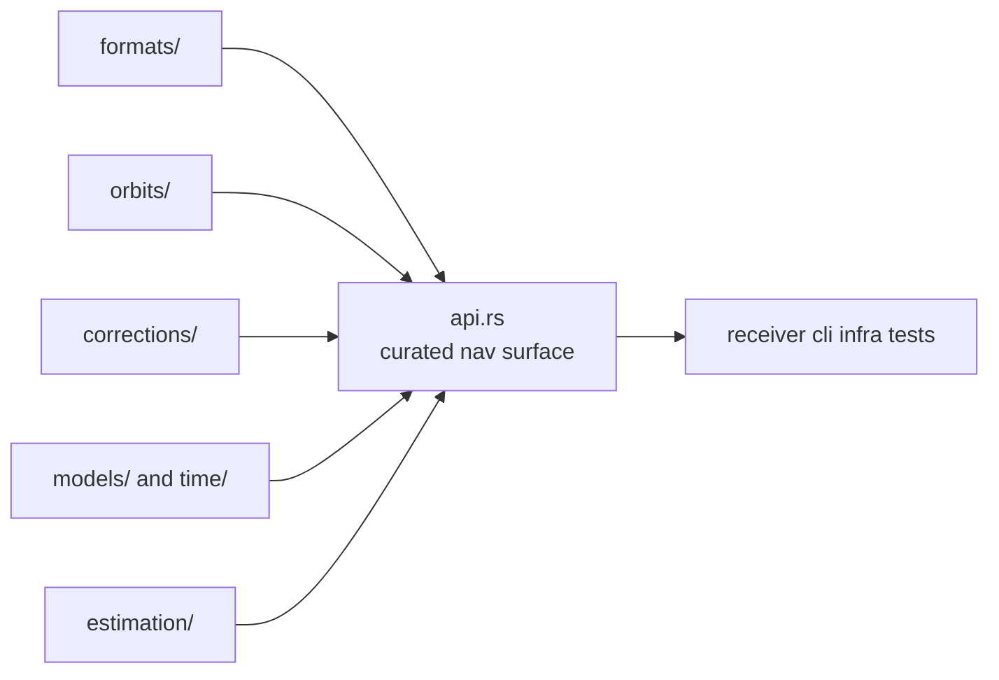

# Architecture

Open this section when the question is structural: where formats, orbits,
corrections, models, and estimation families live in code, and how the crate
stays broad without becoming a shapeless monolith.

## Structural Shape

`bijux-gnss-nav` is not one pipeline. It is a scientific package with explicit
subsystems: product interpretation, orbit and time reasoning, correction law,
and multiple estimation families that share physical assumptions but keep
separate responsibilities.

## Read These First

- open [Module Map](module-map.md) first when you need the fastest route from
  a scientific concern to the owning code area
- open [Dependency Direction](dependency-direction.md) when the question is
  whether `nav` is aggregating lower-level behavior honestly
- open [Integration Seams](integration-seams.md) when a change seems to pull
  runtime or persistence policy inward

## Pages In This Section

- [Module Map](module-map.md)
- [Dependency Direction](dependency-direction.md)
- [Execution Model](execution-model.md)
- [State And Persistence](state-and-persistence.md)
- [Integration Seams](integration-seams.md)
- [Error Model](error-model.md)
- [Extensibility Model](extensibility-model.md)
- [Code Navigation](code-navigation.md)
- [Architecture Risks](architecture-risks.md)

## First Proof Check

- `crates/bijux-gnss-nav/src/lib.rs`
- `crates/bijux-gnss-nav/src/formats.rs`
- `crates/bijux-gnss-nav/src/estimation.rs`
- `crates/bijux-gnss-nav/docs/ARCHITECTURE.md`

## Leave This Section When

- leave for [Foundation](../foundation/) when the real dispute is still about
  ownership rather than structure
- leave for [Interfaces](../interfaces/) when the architectural question is
  already about public contract shape
- leave for [Quality](../quality/) when the structure is clear and the next
  question is proof sufficiency
