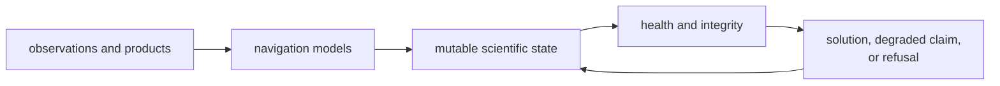
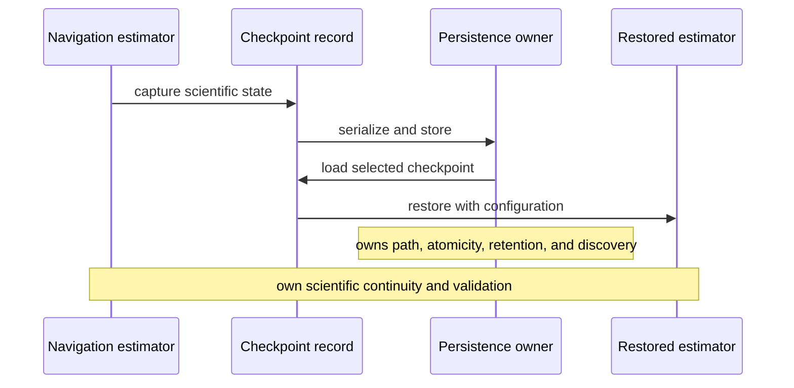
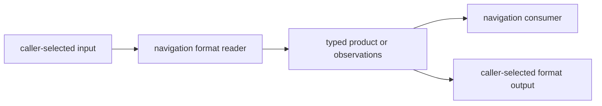

# Navigation State and Persistence Boundaries

Navigation owns scientific state that evolves across observations. It also owns
domain format readers and writers. It does not own repository discovery, run
directories, artifact indexing, history, or command resume policy.

## Scientific State Owned Here

| State family | Examples | Required continuity |
| --- | --- | --- |
| broadcast and precise products | decoded ephemerides, orbit and clock records, antenna and bias products, interpolation support | product identity, time system, coverage, provenance, and validity |
| position estimation | filter state, covariance, innovation history, robust weighting, smoothing, and integrity evidence | epoch order, measurement assumptions, health, and refusal |
| PPP | dynamic state identities, ambiguities, ionosphere, phase windup, product support, residual history, and health | satellite and signal identity, lifecycle, correction context, and uncertainty |
| RTK | base/rover alignment, single and double differences, ambiguity state, covariance, fix evidence, and hold validation | reference identity, epoch alignment, integer transform, and fix status |
| time and correction models | constellation offsets, atmosphere, ionosphere, tides, antenna effects, and Earth rotation | reference epoch, frame, units, and model provenance |

State is not persistence. An estimator may retain covariance and history for
many epochs while remaining independent of where a run is stored.

## Checkpoints Preserve Meaning, Not Storage Policy

Public EKF and PPP filter types expose checkpoint and restoration operations.
The checkpoint structs derive serialization, but the structs themselves are not
re-exported through the curated navigation API. Navigation nevertheless owns
their scientific shape and restoration semantics:

- which scientific values are needed to continue
- restoration of vectors, covariance, labels, identities, and lifecycle state
- validation needed after restoration
- equivalence between uninterrupted and resumed estimator behavior

Navigation does not choose checkpoint filenames, directories, retention,
atomic-write strategy, or operator resume flags.

The [EKF checkpoint tests](../../../crates/bijux-gnss-nav/tests/integration_checkpoint.rs)
cover round-trip state and resumed-update agreement. PPP checkpoint restoration
has source-local tests for phase-windup continuity, lifecycle bookkeeping, and
state identity reconstruction. Neither evidence set proves durable file
atomicity or compatibility across releases.

## Domain File I/O Belongs With Format Semantics

Navigation opens and writes some caller-selected files because format semantics
belong here:

- RINEX observation and navigation readers and writers
- CSV ephemeris loading
- parsers for broadcast and precise products supplied as text

The caller still owns discovery and placement. Navigation should receive an
explicit path or content, interpret the format, and return typed state or a
domain error.

Format I/O must not grow into:

- searching datasets or repository roots
- choosing the latest product automatically
- assigning run identity
- writing manifests or history
- selecting artifact names from command context
- retrying or recovering according to operator policy

The [format guide](../../../crates/bijux-gnss-nav/docs/FORMATS.md) defines
domain parsing. The [infrastructure ownership boundary](../../03-bijux-gnss-infra/foundation/ownership-boundary.md)
defines repository persistence.

## State Identity Must Survive Restoration

Vectors and matrices are not self-describing. A restored filter must preserve:

- state dimension and covariance shape
- state labels or typed identities
- satellite, signal, and constellation associations
- epoch and last-seen bookkeeping
- ambiguity and phase-windup continuity
- product-support and correction assumptions
- health and refusal semantics needed before the next claim

Deserialization success alone does not prove a valid checkpoint. Restoration
must reject or explicitly repair incompatible identity layouts rather than
silently attaching old values to new meanings.

## Review A Stateful Change

1. identify every value whose history affects the next output
2. state initialization, update, reset, and refusal rules
3. decide whether checkpoint state must change
4. prove uninterrupted and restored execution agree for the claimed interval
5. inspect serialized compatibility when checkpoint shape changes
6. keep storage and command policy with their owners

For precise-product changes, also review the default `precise-products`
feature and behavior without it. Feature selection must not make checkpoint or
output meaning ambiguous.

## Current Limits To Keep Visible

- EKF checkpoint integration evidence does not cover PPP or RTK persistence.
- PPP restoration evidence is source-local, not a cross-release file fixture.
- Checkpoint structs are serializable but are not named exports in the curated
  public API.
- Serializable checkpoint types do not define atomic storage or retention.
- The CSV ephemeris provider reduces file and parsing failures to a broad
  unsupported-format result and skips malformed rows until no valid entry
  remains.
- Domain format writers prove format output, not repository manifest
  consistency.

Navigation state is well bounded when a filter can continue from explicit
scientific state while another owner remains free to choose how, where, and
whether that state is persisted.
