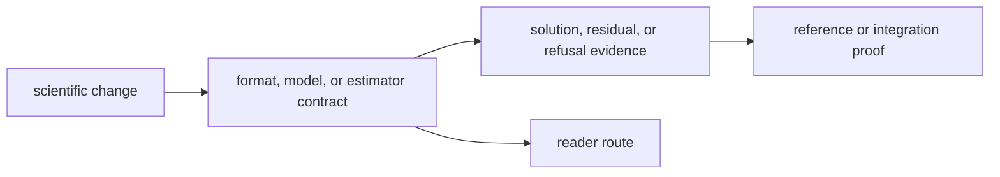

# Change Principles

Changes to `bijux-gnss-nav` should preserve scientific legibility, not only
compile or benchmark behavior.

## Change Flow

## Principles

- prefer exposing scientific families through durable public surfaces rather
  than making downstream crates reach into internal files
- keep parser, correction, and estimator law near the families that own it
  instead of centralizing everything in one convenience module
- add runtime or repository integration only through explicit seams, never by
  letting those concerns backfill into solver code
- treat refusal paths and integrity evidence as first-class outcomes, not as
  second-order error handling
- widen public API only when multiple downstream owners genuinely need a stable
  scientific contract

## Reader Impact

| reader | needs to know |
| --- | --- |
| solver maintainer | which estimator, residual, or refusal behavior changed |
| product-format maintainer | which external product fields or validity rules changed |
| receiver maintainer | whether observation handoff assumptions changed |
| evidence reviewer | which proof shows scientific correctness and unsafe refusal |

## Warning Signs

- a new helper is easier to describe by its caller than by its scientific role
- a solver change adds file-path or command-default knowledge
- product parsing begins to depend on repository layout assumptions

## Review Checks

- Does the change name the scientific family it belongs to?
- Does validation prove the science, not only the caller route?
- Are refusal and uncertainty semantics preserved or deliberately changed?
