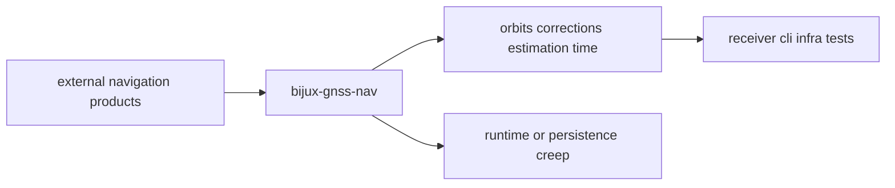

# Foundation

Open this section when the question is why `bijux-gnss-nav` owns a piece of
GNSS science before the receiver, CLI, or infrastructure layers start pulling
it toward convenience.

## Boundary Model

The navigation boundary is only trustworthy when readers can see where product
interpretation, correction law, and estimator behavior stop, and where runtime
control or repository ownership must take over.

## Read These First

- open [Ownership Boundary](ownership-boundary.md) first when a feature feels
  adjacent to `receiver`, `infra`, or `core`
- open [Package Overview](package-overview.md) when you need the shortest
  durable description of the crate role
- open [Scope and Non-Goals](scope-and-non-goals.md) when the question is what
  navigation science should explicitly refuse

## The Mistake This Section Prevents

The most common mistake here is assuming that "navigation-related" means
everything between samples and a position fix belongs in one crate. This
section keeps product interpretation, solver behavior, runtime control, and
repository evidence from collapsing into one blurred owner.

## Pages In This Section

- [Package Overview](package-overview.md)
- [Scope and Non-Goals](scope-and-non-goals.md)
- [Ownership Boundary](ownership-boundary.md)
- [Repository Fit](repository-fit.md)
- [Domain Language](domain-language.md)
- [Dependencies and Adjacencies](dependencies-and-adjacencies.md)
- [Change Principles](change-principles.md)

## First Proof Check

- `crates/bijux-gnss-nav/README.md`
- `crates/bijux-gnss-nav/docs/BOUNDARY.md`
- `crates/bijux-gnss-nav/src/formats/`
- `crates/bijux-gnss-nav/src/orbits/`
- `crates/bijux-gnss-nav/src/estimation/`

## Leave This Section When

- leave for [Interfaces](../interfaces/) when the dispute is already about a
  public decoder, solver, or time contract
- leave for [Architecture](../architecture/) when the ownership question is
  settled and the next question is where the code lives
- leave for [Quality](../quality/) when the boundary is clear and the question
  becomes whether the trust story is honest enough
