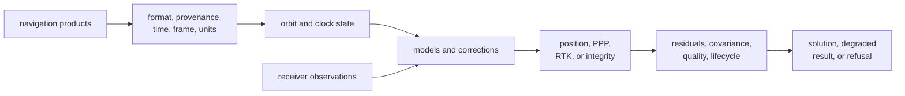
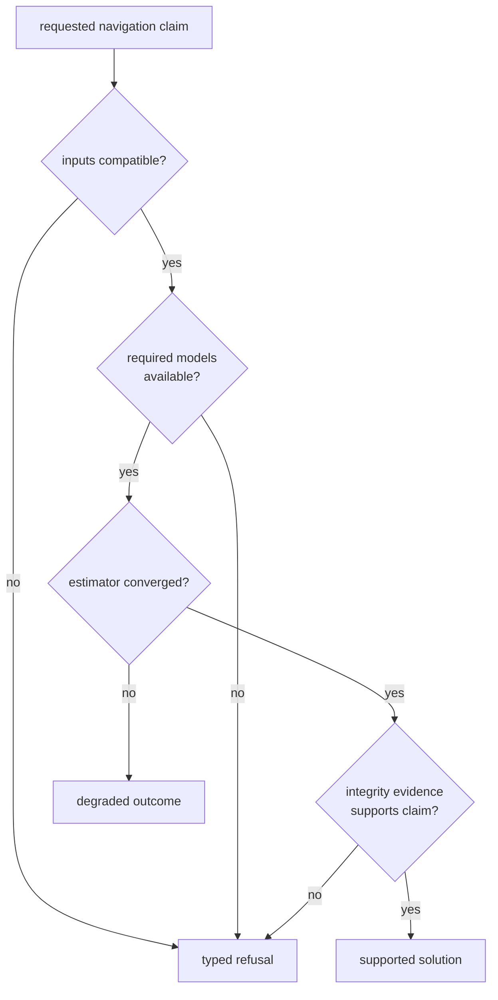

# Navigation Science Foundations

`bijux-gnss-nav` turns receiver observations and external navigation products
into satellite state, corrected measurements, estimates, integrity evidence,
and typed refusals. Its central obligation is not to produce coordinates; it is
to make every navigation claim traceable to compatible inputs, explicit
models, and evidence appropriate to the claimed result.

## Follow A Navigation Claim

No stage may silently fill missing time context, substitute an incompatible
product, discard correction assumptions, or convert failed prerequisites into
a plausible-looking position.

## Start From The Scientific Question

| question | contract |
| --- | --- |
| How is an external product parsed and attributed? | [Format and product contracts](../interfaces/format-and-product-contracts.md) |
| How is satellite position, clock, and uncertainty derived? | [Orbit contracts](../interfaces/orbit-contracts.md) |
| Which atmospheric, bias, antenna, tide, or combination model applies? | [Correction contracts](../interfaces/correction-contracts.md) and [time and model contracts](../interfaces/time-and-model-contracts.md) |
| What supports a position, PPP, RTK, or integrity outcome? | [Estimation contracts](../interfaces/estimation-contracts.md) |
| Does this concern belong to navigation at all? | [Ownership boundary](ownership-boundary.md) |
| Which proof is required before changing the claim? | [Navigation quality model](../quality/) |

## Minimum Evidence For A Result

A reviewable navigation outcome identifies:

- the observations and product provenance used;
- constellation, signal, time system, coordinate frame, and units;
- orbit, clock, atmospheric, bias, antenna, and combination assumptions that
  materially affect the result;
- product gaps, fallbacks, exclusions, and rejected measurements;
- residual, covariance, uncertainty, convergence, and integrity evidence
  appropriate to the solution class;
- lifecycle, degraded, invalid, or refused state when prerequisites are not
  met.

The exact evidence differs by claim. A standalone position, an RTK baseline,
and a precise point positioning state do not earn trust through the same
thresholds or lifecycle.

## Interpret Refusal As A Result

Refusal preserves scientific meaning. Replacing it with a default coordinate,
an empty residual set, or a nominal quality label would destroy evidence that
callers need for safe fallback and diagnosis.

## Boundary With Neighboring Packages

- Core defines shared observation and solution record meaning.
- Signal defines reusable code, sample, and DSP behavior.
- Receiver produces observations and owns runtime stage behavior.
- Infrastructure persists products, manifests, and result artifacts.
- The command package selects workflows and renders reports.
- Navigation owns the scientific interpretation between observations and a
  supported or refused navigation claim.

Use the [package overview](package-overview.md) for the concise package role,
[scope and non-goals](scope-and-non-goals.md) for explicit refusals,
[dependencies and adjacencies](dependencies-and-adjacencies.md) for handoffs,
and [change principles](change-principles.md) before altering scientific
behavior.

Implementation evidence begins with the
[navigation architecture](../../../crates/bijux-gnss-nav/docs/ARCHITECTURE.md),
[format guide](../../../crates/bijux-gnss-nav/docs/FORMATS.md),
[orbit guide](../../../crates/bijux-gnss-nav/docs/ORBITS.md),
[correction guide](../../../crates/bijux-gnss-nav/docs/CORRECTIONS.md),
[estimation guide](../../../crates/bijux-gnss-nav/docs/ESTIMATION.md), and
[time guide](../../../crates/bijux-gnss-nav/docs/TIME.md).
