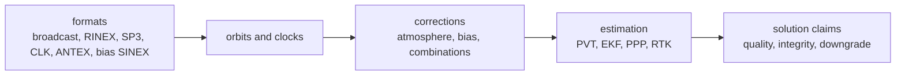

# Package Overview

`bijux-gnss-nav` owns navigation-domain science: external navigation products
become typed satellite state, corrections become explicit model evidence, and
observations become solution claims through estimators.

This crate is not generic file I/O and not receiver runtime scheduling. It is
where navigation meaning is interpreted after bytes, observations, or product
records have reached the navigation boundary.

## Navigation Flow

## Owned Families

| family | owns | first proof |
| --- | --- | --- |
| formats | GPS LNAV/CNAV, Galileo FNAV/INAV, BeiDou, GLONASS, RINEX navigation and observation, SP3, CLK, ANTEX, bias SINEX | `crates/bijux-gnss-nav/src/formats/`, `crates/bijux-gnss-nav/docs/FORMATS.md` |
| orbits | broadcast and precise satellite state for supported constellations | `crates/bijux-gnss-nav/src/orbits/`, `crates/bijux-gnss-nav/docs/ORBITS.md` |
| corrections | atmosphere, ionosphere, group delay, code and phase bias, combinations, phase windup, measured ionosphere | `crates/bijux-gnss-nav/src/corrections/`, `crates/bijux-gnss-nav/docs/CORRECTIONS.md` |
| estimation | position, integrity, smoothing, EKF, PPP, RTK, ambiguity and baseline evidence | `crates/bijux-gnss-nav/src/estimation/`, `crates/bijux-gnss-nav/docs/ESTIMATION.md` |
| models | antenna, atmosphere, celestial, NeQuick, ocean tide loading, solid earth tide support | `crates/bijux-gnss-nav/src/models/`, `crates/bijux-gnss-nav/docs/MODELS.md` |
| navigation time | GNSS-specific time utilities and rollover interpretation above core time types | `crates/bijux-gnss-nav/src/time.rs`, `crates/bijux-gnss-nav/src/time/rollover.rs` |

## Reader Rules

- Start here when a claim depends on navigation interpretation, not just on
  how a command found a file or how a receiver scheduled a run.
- Leave for `bijux-gnss-infra` when the question is repository file discovery,
  dataset registry state, sidecars, run layout, or persisted provenance.
- Leave for `bijux-gnss-receiver` when the question is how observations were
  produced or how navigation solving was invoked inside a receiver run.
- Leave for `bijux-gnss-core` when the question is shared observation,
  navigation-epoch, unit, diagnostic, or artifact-envelope meaning.
- Leave for `bijux-gnss-signal` when the question is signal code, carrier,
  wavelength, raw-IQ, or DSP behavior before navigation interpretation.

## Scientific Guardrails

Navigation changes must preserve the route from input product to solution
claim. A parser change without estimator proof can still be correct, but the
reader needs to know which tests prove parse semantics and which tests prove
solution behavior. PPP and RTK claims need especially clear downgrade and
quality evidence because higher-level crates can render those results without
owning their scientific validity.

## First Proof Check

Inspect `crates/bijux-gnss-nav/README.md`,
`crates/bijux-gnss-nav/docs/FORMATS.md`,
`crates/bijux-gnss-nav/docs/CORRECTIONS.md`,
`crates/bijux-gnss-nav/docs/ESTIMATION.md`,
`crates/bijux-gnss-nav/src/api.rs`, and the integration tests named in the
crate README.
