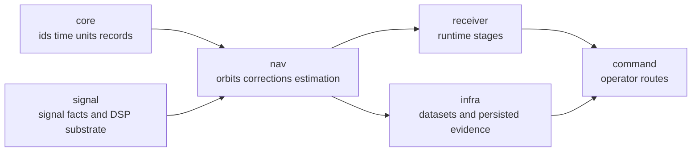

# Repository Fit

`bijux-gnss-nav` is the scientific middle layer of `bijux-telecom`. It turns
shared records, decoded navigation products, correction models, and estimator
state into navigation-domain evidence. It does not own command UX, receiver
scheduling, repository persistence, or reusable signal substrate.

## Repository Role

Nav is reusable science. Receiver code may call it during runtime, infra may
store evidence that came from it, and command code may present its results. None
of those consumers redefine the scientific meaning that nav owns.

## Fit To Defend

| neighbor | nav consumes | nav refuses |
| --- | --- | --- |
| core | shared identity, units, time, coordinate, observation, and artifact records | changing shared record semantics locally |
| signal | signal identity and reusable signal facts when navigation models need them | spreading-code generation or receiver search policy |
| receiver | observation and runtime evidence as inputs to estimation | stage scheduling, lock transitions, channel lifecycle |
| infra | precise-product bytes and persisted evidence after repository resolution | dataset registry, run directory layout, artifact indexing |
| command | operator-visible results after lower owners finish | command syntax, report routing, CLI validation flow |

## Reader Questions

- Is the question about broadcast orbit, precise orbit, clock, correction,
  estimator, PPP, RTK, or navigation product decoding? Stay in nav.
- Is the question about field meaning shared across all crates? Start in core.
- Is the question about sample loops, acquisition, tracking, or observation
  production? Leave for receiver.
- Is the question about where a product file lives or how a run is persisted?
  Leave for infra.
- Is the question about what an operator invokes or sees? Leave for command
  docs.

## First Proof Check

Inspect `crates/bijux-gnss-nav/docs/BOUNDARY.md`,
`crates/bijux-gnss-nav/docs/CONTRACTS.md`,
`crates/bijux-gnss-nav/docs/FORMATS.md`,
`crates/bijux-gnss-nav/docs/CORRECTIONS.md`,
`crates/bijux-gnss-nav/docs/ESTIMATION.md`, and
`crates/bijux-gnss-nav/docs/ORBITS.md`.
