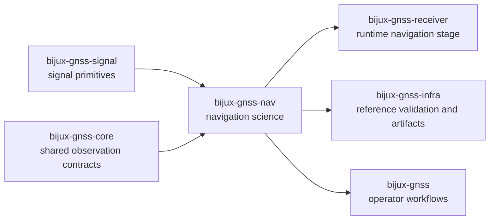

# bijux-gnss-nav

`bijux-gnss-nav` owns navigation-domain science in `bijux-telecom`. This is
where orbital products, message formats, corrections, physical models, and
positioning estimators become explicit package-owned behavior instead of being
hidden inside the receiver or the CLI.

The core question this package answers is not "can we track a signal?" but
"given measurements and reference products, what navigation truth is the
system claiming, and under which models?"

## Why This Package Exists

- broadcast orbits, precise products, and navigation corrections need one
  scientific owner independent of runtime policy
- message parsing and estimator logic should remain inspectable without having
  to read the receiver pipeline
- PPP, RTK, integrity, and solution claims deserve package-level boundaries,
  not scattered modules under unrelated owners

## What It Owns

- orbit and ephemeris interpretation across supported constellations
- navigation and precise-product parsing families
- atmospheric, bias, and combination corrections
- SPP, PPP, RAIM, EKF, RTK, and related estimation surfaces
- supporting physical models and navigation-specific time helpers

## What It Refuses

- raw-IQ contracts and low-level DSP primitives owned by `bijux-gnss-signal`
- receiver runtime composition owned by `bijux-gnss-receiver`
- dataset registry and run layout persistence owned by `bijux-gnss-infra`
- command-line workflow policy owned by `bijux-gnss`
- shared cross-package identities and artifact envelopes owned by
  `bijux-gnss-core`

## Strongest Proof Surfaces

- crate README:
  [`crates/bijux-gnss-nav/README.md`](../../crates/bijux-gnss-nav/README.md)
- package docs:
  [`crates/bijux-gnss-nav/docs/ORBITS.md`](../../crates/bijux-gnss-nav/docs/ORBITS.md),
  [`crates/bijux-gnss-nav/docs/FORMATS.md`](../../crates/bijux-gnss-nav/docs/FORMATS.md),
  [`crates/bijux-gnss-nav/docs/CORRECTIONS.md`](../../crates/bijux-gnss-nav/docs/CORRECTIONS.md),
  [`crates/bijux-gnss-nav/docs/ESTIMATION.md`](../../crates/bijux-gnss-nav/docs/ESTIMATION.md)
- source roots:
  [`crates/bijux-gnss-nav/src/orbits`](../../crates/bijux-gnss-nav/src/orbits),
  [`crates/bijux-gnss-nav/src/formats`](../../crates/bijux-gnss-nav/src/formats),
  [`crates/bijux-gnss-nav/src/corrections`](../../crates/bijux-gnss-nav/src/corrections),
  [`crates/bijux-gnss-nav/src/estimation`](../../crates/bijux-gnss-nav/src/estimation)
- proof tests:
  [`crates/bijux-gnss-nav/tests`](../../crates/bijux-gnss-nav/tests)

## Start Here When

- the question is about ephemerides, broadcast messages, or precise products
- the issue is how a correction or estimator is defined, not how it is
  scheduled
- a reviewer needs to know whether a navigation claim belongs in science code
  or in runtime orchestration
- a receiver feature seems to depend on navigation-domain assumptions that need
  to be proven separately

## Reader Questions This Package Can Answer

- which models, corrections, and estimators are treated as package-owned
  navigation behavior
- where RINEX and constellation-specific navigation formats are parsed
- how orbit state and correction families are separated from runtime execution
- where solution-quality claims should be challenged first

## Leave This Handbook When

- the question becomes about signal-code or sample primitives:
  [06-bijux-gnss-signal](../06-bijux-gnss-signal/)
- the question becomes about receiver-stage execution or observation-to-PVT
  flow:
  [05-bijux-gnss-receiver](../05-bijux-gnss-receiver/)
- the question becomes about persisted references or artifact inspection:
  [03-bijux-gnss-infra](../03-bijux-gnss-infra/)
- the question becomes about shared types or observation contracts:
  [02-bijux-gnss-core](../02-bijux-gnss-core/)

## First Proof Check

- `crates/bijux-gnss-nav/src/orbits/`
- `crates/bijux-gnss-nav/src/formats/`
- `crates/bijux-gnss-nav/src/corrections/`
- `crates/bijux-gnss-nav/src/estimation/`
- `crates/bijux-gnss-nav/src/models/`
- `crates/bijux-gnss-nav/docs/ESTIMATION.md`
