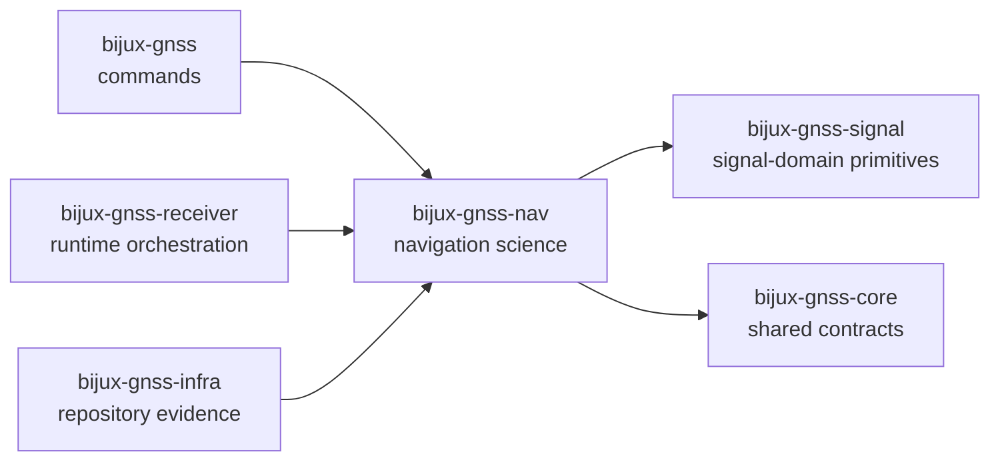

# bijux-gnss-nav

`bijux-gnss-nav` owns navigation-domain GNSS science in `bijux-gnss`. This
crate is where external navigation products become typed state, where orbit and
clock models are interpreted, and where correction, positioning, integrity,
PPP, and RTK behavior stay explicit instead of being scattered across the
receiver, CLI, or infrastructure layers.

This package matters because GNSS navigation is not one algorithm. It is a
stack of scientific obligations: time-scale interpretation, product parsing,
physical models, correction law, and estimator behavior all have to agree
before a higher layer can claim a trustworthy solution.

## Read These First

- open [Foundation](foundation/) when the question is why this crate owns a
  scientific concern at all
- open [Interfaces](interfaces/) when the dispute is already about public
  decoders, orbit products, solver types, or time and correction contracts
- open [Architecture](architecture/) when the question is structural: where
  formats, corrections, estimation, models, and orbit logic live in code
- open [Quality](quality/) when ownership is clear and the question becomes
  whether the proof bar is strong enough

## Why This Package Exists

- one crate needs to own how navigation truth enters the repository from
  broadcast messages, RINEX files, and precise products
- correction law and estimator behavior should be reusable scientific surfaces,
  not receiver-local implementation details
- navigation-time interpretation and constellation-specific orbit logic need a
  single owner instead of being reimplemented in commands and tests

## What It Owns

- constellation-specific broadcast ephemeris and precise-product
  interpretation
- navigation-product and observation parser families tied to GNSS domain
  meaning
- atmospheric, bias, and signal-combination corrections
- position, integrity, PPP, and RTK estimator behavior
- navigation-specific time systems, rollover logic, and supporting physical
  models

The durable science families today are formats, orbits, corrections,
estimation, physical models, and navigation-owned time handling. The handbook
should route readers into one of those owners quickly instead of flattening
them into one generic "nav logic" bucket.

## What It Refuses

- sample scheduling, capture flow, and runtime channel orchestration owned by
  `bijux-gnss-receiver`
- raw signal generation and spreading-code surfaces owned by
  `bijux-gnss-signal`
- repository run layout, manifests, and dataset registry mechanics owned by
  `bijux-gnss-infra`
- command UX and operator entrypoints owned by `bijux-gnss`
- cross-package shared contracts that belong in `bijux-gnss-core`

## Strongest Proof Surfaces

- crate README:
  [Navigation crate README](../../crates/bijux-gnss-nav/README.md)
- crate-local scientific docs:
  [Navigation architecture](../../crates/bijux-gnss-nav/docs/ARCHITECTURE.md),
  [Navigation contracts](../../crates/bijux-gnss-nav/docs/CONTRACTS.md),
  [Orbit guide](../../crates/bijux-gnss-nav/docs/ORBITS.md),
  [Correction guide](../../crates/bijux-gnss-nav/docs/CORRECTIONS.md),
  [Estimation guide](../../crates/bijux-gnss-nav/docs/ESTIMATION.md),
  [Navigation time guide](../../crates/bijux-gnss-nav/docs/TIME.md)
- source roots:
  [format source](../../crates/bijux-gnss-nav/src/formats),
  [orbit source](../../crates/bijux-gnss-nav/src/orbits),
  [correction source](../../crates/bijux-gnss-nav/src/corrections),
  [estimation source](../../crates/bijux-gnss-nav/src/estimation)
- proof tests:
  [navigation integration tests](../../crates/bijux-gnss-nav/tests)

## Support Crates That Matter Here

- `bijux-gnss-policies` helps keep navigation science from quietly turning into
  a repository bucket or public-surface dumping ground; inspect it when a nav
  change also modifies guardrail expectations.
- `bijux-gnss-testkit` is the main shared truth supplier for reference-backed
  navigation checks; inspect it when a scientific claim depends on benchmark
  fixtures, independent models, or deterministic validation scenarios.

## Sections In This Handbook

- [Foundation](foundation/) for role, scope, ownership, repository fit, and
  navigation vocabulary
- [Architecture](architecture/) for module layout, dependency direction,
  persistence boundaries, and integration seams
- [Interfaces](interfaces/) for public API, product contracts, correction
  contracts, estimator contracts, and compatibility expectations
- [Operations](operations/) for safe change sequence, verification, review
  scope, and benchmark-aware maintenance
- [Quality](quality/) for invariants, proof strategy, limitations, risk, and
  change validation
- [Navigation ownership boundaries](ownership-boundaries.md) for deciding
  whether behavior is navigation science or a neighboring concern

## Start Here When

- the question is how a navigation file or precise product becomes typed GNSS
  state
- the issue is whether a correction or estimator belongs in navigation science
  or in runtime orchestration
- the reader needs to understand which crate owns time-scale interpretation,
  RAIM evidence, PPP state, or RTK differencing behavior
- a reviewer wants to know whether a public navigation claim is backed by a
  real scientific owner

## Reader Questions This Package Can Answer

- how broadcast and precise orbital products are turned into solver-ready state
- why corrections and estimators belong together here without collapsing into a
  single monolith
- where GNSS-specific time handling stops being a core concern and becomes a
  navigation concern
- how public orbit, correction, and position surfaces stay usable by higher
  crates without exposing every internal helper

## Leave This Handbook When

- the question becomes about user-facing commands:
  [Command handbook](../01-bijux-gnss/)
- the question becomes about shared observation or artifact schemas:
  [Core handbook](../02-bijux-gnss-core/)
- the question becomes about persisted repository evidence:
  [Infra handbook](../03-bijux-gnss-infra/)
- the question becomes about runtime scheduling and acquisition or tracking
  orchestration:
  [Receiver handbook](../05-bijux-gnss-receiver/)

## Evidence Routes

- [curated navigation API source](../../crates/bijux-gnss-nav/src/api.rs)
- [format source](../../crates/bijux-gnss-nav/src/formats/)
- [orbit source](../../crates/bijux-gnss-nav/src/orbits/)
- [correction source](../../crates/bijux-gnss-nav/src/corrections/)
- [estimation source](../../crates/bijux-gnss-nav/src/estimation/)
- [model source](../../crates/bijux-gnss-nav/src/models/)
- [rollover handling source](../../crates/bijux-gnss-nav/src/time/rollover.rs)
- [public API guide](../../crates/bijux-gnss-nav/docs/PUBLIC_API.md)

## Design Pressure

If `bijux-gnss-nav` starts carrying command policy, repository persistence, or
receiver scheduling because those surfaces "need science nearby," the crate
stops being a trustworthy owner and becomes a convenience bucket.
