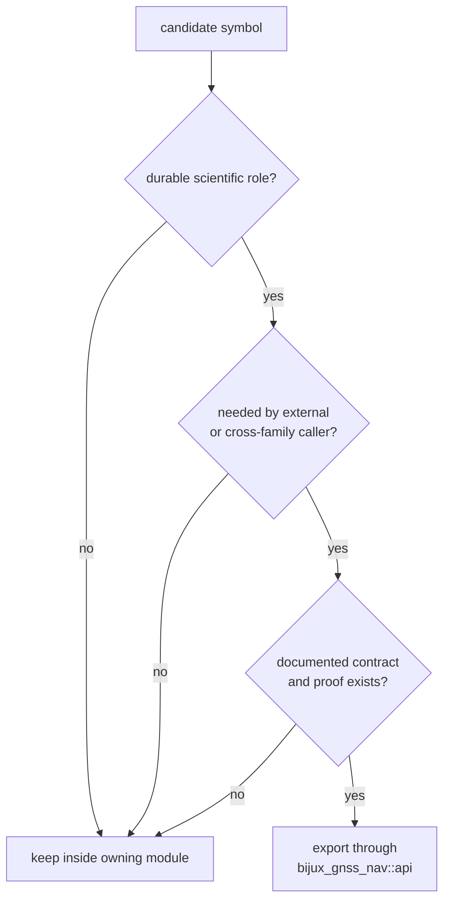

# API Surface

`bijux-gnss-nav` publishes one deliberate downstream surface:
`bijux_gnss_nav::api`. A symbol belongs there only when an external crate can
use it without depending on nav's internal file layout.

## Export Decision Flow

## Public Families

| family | exported role | keep internal |
| --- | --- | --- |
| artifacts | versioned wrappers such as GPS ephemeris and PPP solution epochs | storage paths and report routing |
| corrections | atmosphere, bias, ionosphere-free, geometry-free, narrow-lane, phase-windup, and residual diagnostics | one-parser correction scratch state |
| estimation | EKF primitives, position runtime, integrity checks, RAIM, PPP, RTK, trajectory reports, solution claims | solver-internal mutation helpers |
| formats and products | broadcast navigation decoders, RINEX, SP3, CLK, ANTEX, and bias SINEX readers | parser-local bit cursors and intermediate fields |
| orbits | ephemeris and satellite-state helpers used by positioning | constellation-private decode staging |
| models and time | antenna, atmosphere, tide, NeQuick, time-system, rollover, and civil-time helpers | generic utilities not tied to navigation |
| support math | small matrix and geodesy helpers needed by downstream consumers | private numerical scaffolding |
| engine seam | `NavEngine` and runtime-facing navigation traits | crate-internal orchestration details |

## Export Rules

- Export by durable scientific role, not by source-file convenience.
- Keep parser-local helpers, solver-internal state mutation, and narrow caller
  shortcuts out of `api.rs`.
- Add or remove exports with docs and tests that prove the external contract.
- Preserve compatibility unless the repository intentionally changes the public
  contract and documents the migration path.
- Keep source modules as the owner of behavior; `api.rs` is the curated doorway,
  not the implementation owner.

## First Proof Check

Inspect `crates/bijux-gnss-nav/src/api.rs`,
`crates/bijux-gnss-nav/API.md`,
`crates/bijux-gnss-nav/docs/PUBLIC_API.md`, and the owning module docs for any
newly exported family before changing the public surface.
