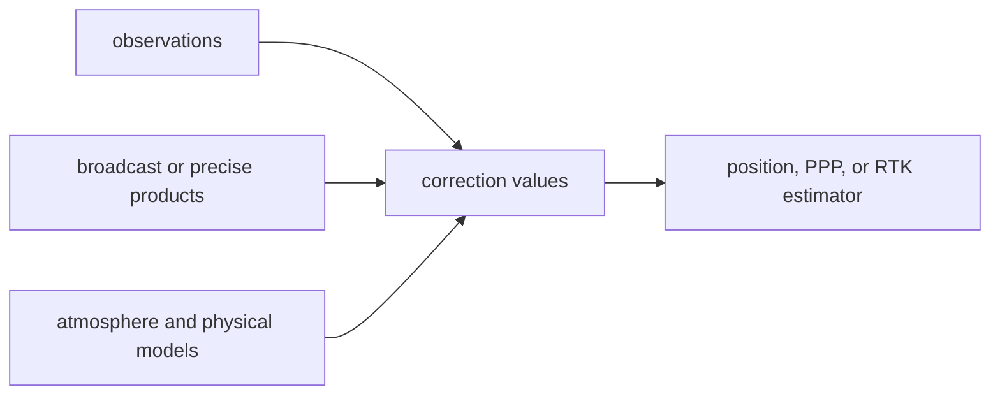

# Correction Contracts

Correction contracts are reusable navigation science between observations and
solution estimates. They encode physical assumptions: atmosphere, ionosphere,
group delay, biases, signal combinations, and carrier effects.

They are public contracts only when more than one solver, product path, or
higher-level crate needs the same correction meaning.

## Correction Flow

## Contract Families

| family | owns | first proof |
| --- | --- | --- |
| atmosphere and ionosphere | atmospheric context, broadcast ionosphere, measured ionosphere, residual summaries | `crates/bijux-gnss-nav/src/corrections/atmosphere.rs`, `crates/bijux-gnss-nav/src/corrections/broadcast_ionosphere_residuals.rs`, `crates/bijux-gnss-nav/src/corrections/measured_ionosphere.rs` |
| biases and group delay | code bias, phase bias, broadcast group-delay conversions | `crates/bijux-gnss-nav/src/corrections/biases.rs`, `crates/bijux-gnss-nav/src/corrections/broadcast_group_delay.rs` |
| combinations | ionosphere-free, geometry-free, narrow-lane, Melbourne-Wubbena, and related combinations | `crates/bijux-gnss-nav/src/corrections/combinations.rs`, `crates/bijux-gnss-nav/src/corrections/iono_free_code.rs`, `crates/bijux-gnss-nav/src/corrections/iono_free_phase.rs`, `crates/bijux-gnss-nav/src/corrections/melbourne_wubbena.rs` |
| carrier effects | phase windup and carrier-aware correction helpers | `crates/bijux-gnss-nav/src/corrections/phase_windup.rs` |
| dual-frequency support | dual-frequency correction and diagnostic surfaces | `crates/bijux-gnss-nav/src/corrections/dual_frequency.rs` |

## Boundary Rules

- Navigation owns correction law and model assumptions.
- Signal owns carrier, wavelength, code, raw-IQ, and DSP behavior before
  navigation correction.
- Core owns shared observation and unit record meaning.
- Receiver owns when a correction is invoked during a runtime pipeline.
- Infra owns persisted product discovery and run evidence around correction
  use.

## Reader Checks

- Which physical assumption changed?
- Which observation, product, or model input is required?
- Does the correction remain reusable across PVT, PPP, RTK, or product
  validation?
- Does a higher-level failure need correction proof or only receiver/infra
  handoff proof?

## First Proof Check

Inspect `crates/bijux-gnss-nav/docs/CORRECTIONS.md`,
`crates/bijux-gnss-nav/src/corrections/`, and correction-focused integration
tests for ionosphere, windup, bias, and signal-combination behavior before
changing correction claims.
