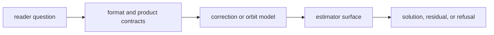

# Entrypoints And Examples

Use this page to choose the right public starting point.

## Entrypoint Flow

## Common Starting Points

- start from `bijux_gnss_nav::api` when you are a downstream crate
- start from the relevant format family when the question begins with external
  navigation data
- start from `PositionSolver`, `NavigationEngine`, or `PositionRuntime` when
  the question is position behavior
- start from `PppFilter` when the question is precise point positioning state
  and lifecycle
- start from RTK execution, ambiguity, or quality helpers when the question is
  differencing and baseline estimation

## Example Reader Routes

| reader question | start with | continue to |
| --- | --- | --- |
| I need to parse an SP3 and feed it to PPP. | precise-product contracts | PPP product-policy surfaces |
| I need to understand why a position solve was refused. | estimation contracts | position solution and integrity evidence |
| I need broadcast time interpretation for a constellation-specific decoder. | format contracts | time contracts |
| I need to review a correction change. | correction-family docs | dependent SPP, RTK, or PPP proof |

## Review Checks

- Does the example route point to the owner before the caller?
- Does the entrypoint hide any required product, frame, or time assumption?
- Can the reader find refusal evidence when a solution is unsafe?
