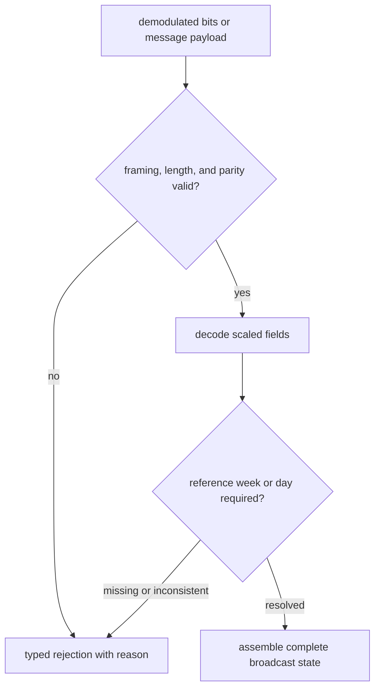
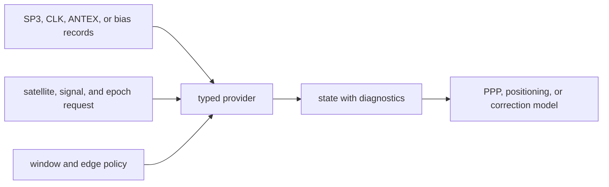

# Navigation Product Trust Boundary

External navigation data becomes usable only after syntax, constellation
semantics, time context, units, and product quality have been made explicit.
`bijux-gnss-nav` owns that scientific interpretation. Locating files, caching
downloads, and choosing command-line inputs remain infrastructure or command
responsibilities.

## From External Data To Navigation Evidence

```mermaid
flowchart LR
    input["caller-supplied bits, bytes, or text"]
    parse["syntax and framing"]
    decode["constellation and format semantics"]
    time["time-system and rollover resolution"]
    product["typed navigation product"]
    policy["selection and interpolation policy"]
    model["orbit, clock, correction, or estimator"]
    evidence["solution, diagnostic, or refusal"]

    input --> parse --> decode --> time --> product --> policy --> model --> evidence
```

Each arrow is a trust boundary. A parser accepting text does not prove that
epochs are resolved correctly. A typed orbit record does not prove that it is
healthy, continuous, current, or suitable for a particular estimator.

## Product Families

| family | accepted meaning | contract that must remain visible |
| --- | --- | --- |
| GPS LNAV and CNAV | navigation words, subframes, ephemeris, clock, group-delay, ionosphere, health, and parity evidence | bit alignment, parity, message identity, reference week, and batch rejection |
| Galileo I/NAV and F/NAV | navigation words or pages, clock and status, ephemeris, harmonics, and broadcast state | word/page type, signal status, reference week, and incomplete-product refusal |
| BeiDou D1 and D2 | subframes or pages, clock, ephemeris, ionosphere, status, and parity evidence | page/subframe identity, reference week, constellation time meaning, and rejection reason |
| GLONASS navigation | strings, frames, parity, slot-aware state, and superframe time | string identity, parity, reference day, slot and frequency context, and time rejection |
| RINEX navigation | broadcast ephemerides and time-system corrections | version, constellation record shape, epoch interpretation, and round-trip limits |
| RINEX observation | constellation channels, epoch records, events, observation values, time system, and code-bias status | observation-code mapping, missing values, event records, bias state, and epoch time |
| SP3 and CLK | precise orbit and clock records exposed through interpolation providers | interpolation window, edge policy, accuracy, discontinuity, and unavailable-state evidence |
| ANTEX and bias SINEX | receiver/satellite antenna calibration and signal-specific code or phase bias | antenna identity, signal mapping, unit, validity window, provenance, and missing-bias behavior |

The [format guide](../../../crates/bijux-gnss-nav/docs/FORMATS.md) gives the
package-level inventory. Supported downstream imports are exposed through the
[navigation API](../../../crates/bijux-gnss-nav/src/api.rs), not private parser
modules.

## Broadcast Decode Contract

Broadcast formats encode truncated or constellation-relative time. APIs that
accept a reference week or day make that dependency reviewable. A decoder must
not infer wall-clock context from the host process or silently choose the
nearest rollover.

Rejection types are part of the contract. Keep framing, parity, page or word
identity, incomplete batches, and temporal ambiguity distinguishable so callers
can decide whether to wait for more data, reject the source, or report degraded
coverage.

## RINEX Contract

RINEX parsing is not generic table loading. The parser must preserve:

- format version and record family;
- constellation and observation-code identity;
- epoch time system and event records;
- absent observations versus numeric zero;
- code-bias application or unknown-bias state;
- time-system corrections in navigation products;
- enough typed information for a writer to state what it cannot reproduce.

Round-trip tests should compare domain meaning, not byte-for-byte whitespace.
Writers may normalize layout, but they must not change satellite identity,
epochs, units, observation availability, or correction state.

The current observation surface has specialized GPS, Galileo, and BeiDou
dataset views as well as a mixed-constellation record model. Adding another
constellation requires explicit channel mapping and unknown-code behavior, not
reuse of the nearest existing labels.

## Precise Product Contract

A precise product provider owns more than interpolation:

- product coverage and validity interval;
- interpolation window and behavior near edges;
- record accuracy and event flags where available;
- discontinuity and gap detection;
- satellite and signal identity;
- distinction between missing data, refused interpolation, and a valid state;
- provenance needed to explain which product supported a solution.

Do not convert unavailable precise data into zero correction. Consumers need
typed absence or refusal so they can apply an explicit downgrade policy.

## Product Composition

`ProductsProvider` and `Products` compose broadcast and precise information for
navigation consumers. Composition must preserve provenance and diagnostics from
each source. Selection policy belongs at this boundary; parsers should not
quietly decide that one provider supersedes another.

When orbit, clock, antenna, and bias products come from different sources,
review epoch coverage, reference frame, time system, signal mapping, and update
interval together. Individually valid files can still form an inconsistent
product set.

## Feature Reality

The package manifest declares `precise-products` and enables it by default, but
the current public source exports are not conditionally compiled by that
feature. One SP3 integration target is feature-gated; the broader precise
product API remains available without default features.

Treat that as the current implementation boundary, not an intended promise that
the flag removes precise-product code. Any change to feature semantics needs
explicit default and feature-disabled API checks plus compatibility
documentation.

## Evidence Map

| claim | representative evidence |
| --- | --- |
| BeiDou and GLONASS messages retain constellation-specific rejection and time behavior | [BeiDou decode evidence](../../../crates/bijux-gnss-nav/tests/integration_beidou_navigation_decode.rs) and [GLONASS decode evidence](../../../crates/bijux-gnss-nav/tests/integration_glonass_navigation_decode.rs) |
| RINEX observation channels and mixed records preserve signal identity | [RINEX channel evidence](../../../crates/bijux-gnss-nav/tests/integration_rinex_observation_channels.rs), [Galileo observation evidence](../../../crates/bijux-gnss-nav/tests/integration_rinex_galileo_observations.rs), and [BeiDou observation evidence](../../../crates/bijux-gnss-nav/tests/integration_rinex_beidou_observations.rs) |
| SP3 and CLK providers meet reference and interpolation expectations | [SP3 reference evidence](../../../crates/bijux-gnss-nav/tests/integration_sp3_reference_accuracy.rs) and [CLK reference evidence](../../../crates/bijux-gnss-nav/tests/integration_clk_reference_accuracy.rs) |
| bias SINEX affects corrections through typed signal biases | [Bias correction evidence](../../../crates/bijux-gnss-nav/tests/integration_bias_sinex_corrections.rs) |
| parsed public observations can feed a position workflow | [Public RINEX position evidence](../../../crates/bijux-gnss-nav/tests/integration_public_rinex_position.rs) |

These tests are representative, not exhaustive. A parser change still needs
focused malformed-input, boundary-time, missing-record, and round-trip evidence
for the exact format family changed.

## Adding Or Changing A Format

1. State the external specification, supported revision, and unsupported
   constructs.
2. Separate framing and syntax errors from scientific rejection.
3. Make constellation, signal, unit, time system, frame, and rollover context
   explicit in typed output.
4. Define missing, unknown, unavailable, and invalid states separately.
5. Add realistic accepted input and one-condition-invalid cases.
6. Test temporal boundaries, interpolation edges, and partial product sets where
   they apply.
7. Prove how the typed product reaches a correction or estimator without
   transferring parser policy into that consumer.
8. Update public API, compatibility notes, and reader documentation together.

Use the [estimation contracts](estimation-contracts.md) when the product reaches
an estimator and the
[compatibility commitments](compatibility-commitments.md) before changing
public records or accepted external syntax.
